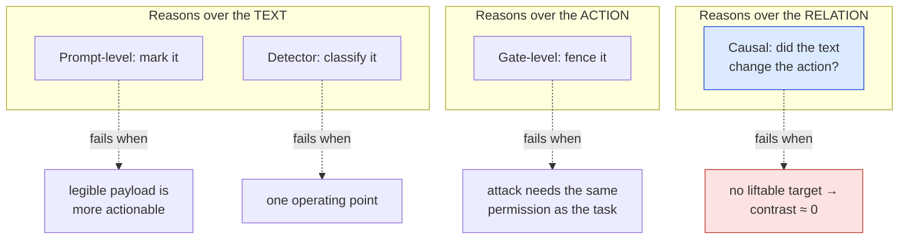

# 02 — Related Work

**Maps to:** manuscript §II.
**Length target:** 1 to 1.5 pages. Organised by *family of idea*, never as a
list of papers. Ends by naming precisely what is missing and what this paper adds.
**Job of this section:** show the reviewer you know the field, place your work
in it, and make the gap visible before you claim to fill it.

The published numbers below are the only ones the paper quotes from other
people. Each lives in `paper/external_numbers.json` with the verbatim sentence it
came from and a `verified: "verbatim"` flag. Do not add a published number that
is not in that file.

---

## 1. Establishing the attack

- **Greshake et al. [5]** characterised indirect prompt injection against
  LLM-integrated applications and showed it needs no access to the user's prompt.
  `[meaning: the founding paper; it proved an attacker can steer an AI just by planting text where the AI will read it]`
- Later work splits into benchmarking how susceptible agents are, and building
  defenses. Both are used here.

## 2. Benchmarks (we use two, and say exactly how)

- **InjecAgent [1].** 1,054 test cases, 17 user tools, 62 attacker
  instructions, split into direct-harm and data-stealing. Reports a
  ReAct-prompted GPT-4 at 24% attack success (base) and 47% with a "hacking
  prompt"; a prompted Llama2-70B above 80%.
  `[meaning: a standard test set of attacks on tool-using agents; even GPT-4 falls for a quarter of them]`
  - We use the **direct-harm split** as our external attack corpus, drawn 30/30
    across two strata (§IV, `results/phase12/manifest.json`).
- **AgentDojo [2].** A dynamic environment: 97 user tasks, 629 security test
  cases, evaluates both attacks and defenses. Version v0.1.35, MIT licence.
  `[meaning: a simulated workplace where an agent does tasks while attacks are planted in its documents]`
  - We use it twice: its **benign documents** (n = 60) are our false-positive
    rate of record, and its **attack side** (n = 60) is the holdout for §VIII.
- **Always state corpus version and licence.** A reviewer cannot check a number
  from an unnamed version.

## 3. Prompt-level defenses

- **Spotlighting [3]** transforms untrusted input so the model has a continuous
  signal of provenance (delimiting, datamarking, encoding). Reports reducing
  attack success "from greater than 50% to below 2%" on GPT-family models.
  `[meaning: mark every word of the suspicious text so the model always knows where it came from]`
  - We **re-implement it inside our own pipeline** rather than quote that figure
    as a comparison, because threat model, model scale and outcome variable all
    differ (§VI).
- **AgentDojo's delimiting arm** is the closest published analogue that carries
  its own undefended row: targeted ASR 57.69% (±3.9) → 41.65% (±3.9) on GPT-4o,
  benign utility 69.0% → 72.66% (Table 5 of [2]).
  `[meaning: the same family of trick, measured properly by someone else, cut attacks by 16 points but left 42% still succeeding]`

## 4. Gate-level defenses

- **AgentDojo's tool filter** is reported in the body text at 7.5% ASR; the same
  paper's Table 5 gives 6.84% (±2.0). We quote the prose and name the table figure
  beside it rather than silently choosing.
  `[meaning: a fence around which tools the agent may call; very effective in their setting; the paper gives two slightly different numbers and we report both]`
- **Our Layer 4** (permission, egress, sandbox) belongs to this family. §V
  reports it as redundant rather than contributing on our corpus.

## 5. Detector-based defenses

- **PIShield [4]** compares nine detectors on short- and long-context
  benchmarks: average FPR from 0.5% to 40.3%, average FNR from 1.4% to 75.9%.
  `[meaning: nine classifiers that look at text and say "injection or not"; they range from excellent to poor]`
- **These classify a text prompt. Ours classifies a turn of an agent loop**, and
  its input is a behavioural contrast, not the text. §XI positions our numbers
  against theirs and says why the comparison is indicative only.

## 6. What separates the families: the unit of evidence

| Family | Reasons over | Load-bearing assumption | Characteristic failure |
| :--- | :--- | :--- | :--- |
| Prompt-level | the **text** | the model honours the mark | making a payload legible can make it more actionable (§VI) |
| Gate-level | the **action** | the attacker's goal needs a permission the user's task does not | fails when both need the same permission (AgentDojo's own boundary; §V) |
| Detector | the **text**, classified | one FPR-vs-miss operating point | the spread of that trade across benchmarks is most of the available range |
| **Causal (this work)** | the **relation** between text and action | the relation is observable | when the span names no liftable target, the contrast is ≈0 (§VII) |

`[meaning: each defense looks at a different thing; ours looks at whether the text changed the action, which only works when there is a visible change to look at]`

## 7. Protocol-surface work (motivates Layers 0 and 1)

- **Ferrag et al. [13]**: a survey of more than thirty attack techniques across
  input manipulation, model compromise, system and privacy attacks, and
  protocol-level vulnerabilities. Our Layers 0 and 1 are drawn against this map.
- **MCPSecBench [11]**: protocol-level attacks succeed against every evaluated
  host platform. This is why Layer 0 exists at all.
- **ETDI [12]**: signed, versioned tool definitions; our server trust registry
  follows them.
- **AutoMalTool [10]**: a detection-oracle design for screening tool metadata at
  registration; our pipeline approximates this rather than performing it,
  because it consumes tool *responses* not server manifests (§XII).
- **MCP-RiskCue [14]**: applies GRPO to risk inference over server logs, the same
  optimiser our adaptive layer uses on a different object.
- **AgentSentry [9]** is the closest work: it also localises injection by
  counterfactual re-execution at tool-return boundaries and purifies context for
  safe continuation. **Our contribution is not that mechanism; it is the finding
  that its discriminative power is governed by whether the span carries a
  liftable target**, which needs the stratified reporting of §VII.
  `[meaning: someone else built a similar detector; we are the first to measure where it stops working and why]`

## 8. What is missing, and what this paper supplies (the closing paragraph)

- **Across the literature, detection is reported pooled.** No surveyed paper
  stratifies detection by whether the injected content names a target the action
  can lift.
- **That split governs our results**, and §XI argues it would be invisible in
  every table we surveyed. A mechanism-dependent collapse of this size could be
  present in any of them and their evaluations, as reported, could not show it.
  `[meaning: everyone reports one average number; our finding is that the average hides a cliff, and nobody else's table could reveal that cliff]`

## Writing rules for this section

- Group by idea, not by paper. A reviewer should be able to skim the bold
  phrases and see the field's shape.
- Every published number gets a citation *and* the setting it was measured in.
  A number without its setting is a claim you cannot defend.
- End on the gap. The last sentence of related work should make the reader
  expect exactly the paper that follows.
