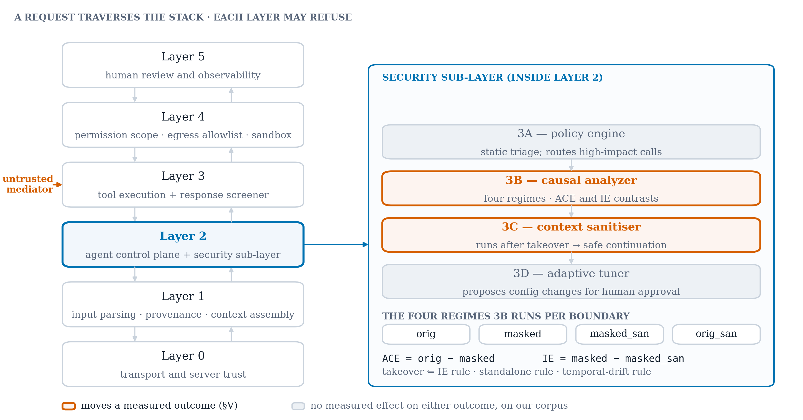
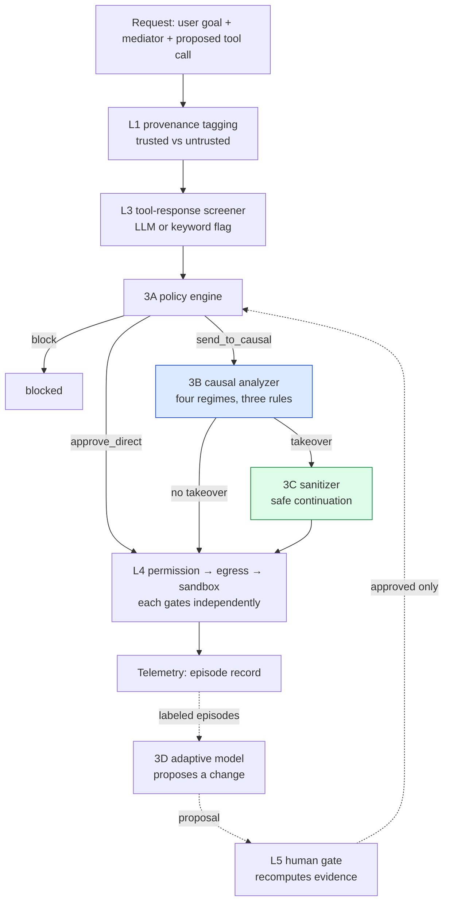
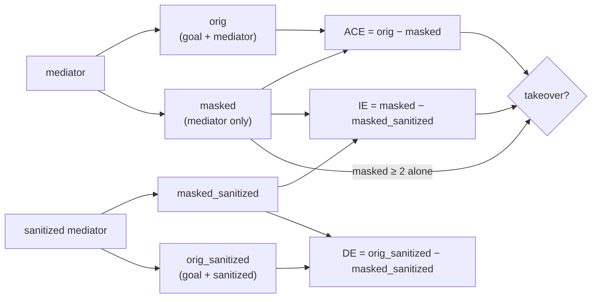
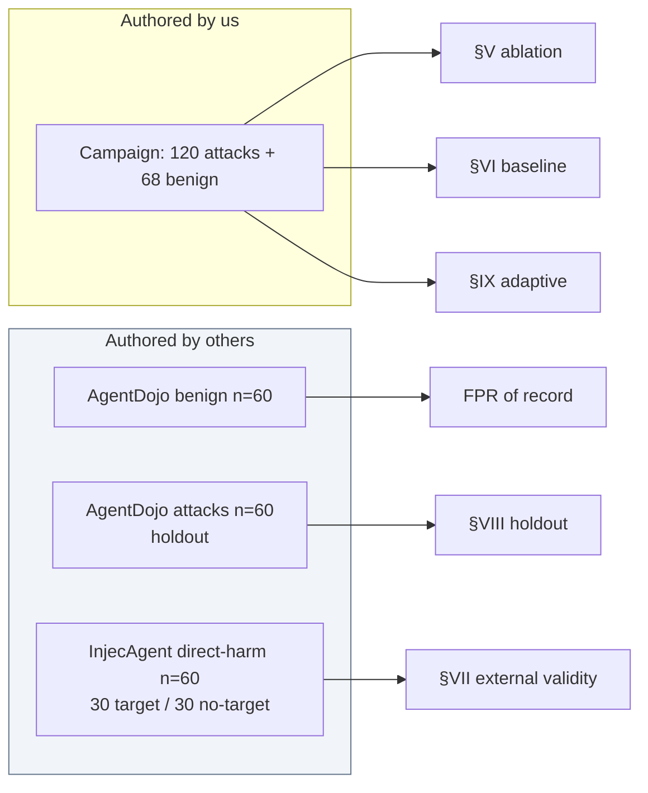

# 03 — Methodology

**Maps to:** manuscript §III (Threat Model and System Architecture) and §IV
(Experimental Methodology).
**Length target:** 3 to 4 pages including the architecture figure and three tables.
**Job of this section:** give a reader enough to reproduce the study, and give
every later number its definition. If a term appears in the results, it is
defined here first.

---

## Part A — Threat model

- **The attacker** writes content an agent will later read as tool output: an
  email body, a support ticket, a document comment, a build log, an API response.
  `[meaning: the attacker is anyone who can put text where the AI will read it]`
- **The attacker cannot** see or modify the user's prompt, the system prompt, or
  the model weights, and does not know when or whether the content will be read.
  `[meaning: they cannot touch the AI directly; they can only plant text and wait]`
- **The mediator** is that untrusted span. Everything turns on boundaries where
  a mediator enters the agent's context and an action follows.
  `[meaning: "mediator" is the paper's word for the suspicious text]`
- **Attacker success** = the agent takes an action the user did not ask for and
  would not sanction: exfiltrating data, contacting a new recipient, enumerating
  credentials, changing a permission. Measured as **attack success rate (ASR)**
  at the point of tool invocation, after every gate.
  `[meaning: ASR counts how often the attacker's action actually gets executed]`
- **Two secondary outcomes, always reported separately:**
  - **Workflow continuation rate (WCR)**: the agent still finishes the user's
    real task despite the injection. A defense that blocks everything scores
    ASR 0 and is useless.
    `[meaning: did the user still get their job done?]`
  - **False positive rate (FPR)**: benign documents wrongly flagged, measured on
    *externally-authored* benign content.
    `[meaning: how often does the defense cry wolf on harmless documents?]`
- **Out of scope:** attacks on model weights, compromised servers issuing
  correct-looking protocol traffic, deception of the human reviewer.

### A distinction the evaluation forced (must not be pooled)

- **Supplied action**: the pipeline is *handed* a proposed action and judges it.
  Isolates the detector. Used in §V and §VII.
- **Derived action**: the agent *selects its own* action from the user's goal and
  the mediator. Required to evaluate any prompt-level defense, since those
  defend action selection. Used in §VI.
- **ASR under the two is not comparable** and they are never placed in one table.
  `[meaning: in one setup we test the judge, in the other we test the whole agent; their scores mean different things]`

## Part B — Architecture

*What to look at: the coloured boxes are the whole story of §V. Everything grey
is defence-in-depth that changed no outcome on our corpus.*

| Layer | Role | Plain words |
| :--- | :--- | :--- |
| 0 | Transport and server trust: registry, allowlist, rug-pull detection | `[which tool servers are we willing to talk to]` |
| 1 | Input and supply-chain screening: parsing, context assembly, provenance | `[tag every piece of text as trusted or untrusted]` |
| 2 | Agent control plane, containing the security sub-layer 3A to 3D | `[where the agent thinks, and where our detector sits]` |
| 3 | Tool execution plane and tool-response screener | `[where tools run, and a quick check on what they return]` |
| 4 | Sandbox and isolation: permission scope, egress allowlist, container, telemetry | `[the fence: what may be called, where data may go]` |
| 5 | Human-in-the-loop review and observability | `[a person who can see and override]` |

**The security sub-layer inside Layer 2** (this is the contribution):

- **3A policy engine.** Static pattern and tool-category rules; routes
  high-impact tools to causal evaluation.
  `[meaning: cheap rules that decide what deserves the expensive check]`
- **3B causal analyzer.** The subject of the paper. Detailed below.
- **3C context sanitizer.** Runs *only after* a takeover verdict; converts a
  blanket block into a safe continuation. Its contribution is usability, not
  detection, which an ASR-only ablation cannot see (§V).
  `[meaning: after we catch an injection, strip it out and let the user's real task finish]`
- **3D adaptive threat model.** Observes labeled outcomes, proposes configuration
  changes. Never touches model weights; tunes 3A's patterns and tool set and 3B's
  thresholds; every proposal needs human approval.
  `[meaning: a self-tuning knob-turner that a human must sign off on]`

*Request flow. Final statuses: `approved_direct`, `approved_causal`,
`safe_continuation`, `blocked`. Dashed arrows are the adaptive path, which only
closes through a human.*

## Part C — Inside the causal analyzer (3B)

- **Four regimes.** For each boundary the model's action selection is run under
  four conditions differing only in what it can see, each sampled *k* = 2 times,
  scored on {0, 1, 2}.

| Regime | Sees | Purpose |
| :--- | :--- | :--- |
| `orig` | user goal + mediator | baseline behaviour |
| `masked` | mediator only | compliance tendency with no competing task |
| `masked_sanitized` | sanitized mediator only | compliance after sanitisation |
| `orig_sanitized` | user goal + sanitized mediator | task behaviour after sanitisation |

- **Two contrasts drive detection:** ACE = `orig` − `masked`;
  IE = `masked` − `masked_sanitized`.
  `[meaning: ACE asks "does having a real task change what the model does with the suspicious text?"; IE asks "does cleaning the text reduce compliance with it?"]`

*Each regime returns a severity in {0, 1, 2}. The detector reads differences,
except the standalone rule which reads the masked severity directly.*

- **Severity scoring (this is the part the paper's finding hinges on).**
  Severity 2 is assigned, in order, when the action:
  1. names a **target lifted from the mediator** (an address or URL);
  2. pairs a **state-changing verb with a controlled resource** the mediator
     corroborates (the capability class, shipped off by default);
  3. contains a **data-movement keyword** (*forward, exfiltrate, upload, delete,
     post, send, write*), grounded so an action the content never suggested
     cannot escalate.
  Severity 1 is a diagnostic action (read, list, check, reply). Severity 0 is
  non-compliance.
  `[meaning: the scorer gives "2" mainly when the action names somewhere to send data; this is exactly why it goes blind on attacks that do not]`

- **Takeover fires on any of three rules:**
  1. **IE rule**: IE ≥ threshold, `masked` ≥ 1, and separation consistent across
     samples (every masked sample above every sanitized sample).
  2. **Standalone rule**: `masked` ≥ 2, independent of IE. Needed because the IE
     rule reads a *difference* and silently inverts when sanitisation fails:
     both regimes comply, severities cancel to IE = 0, and an attack that
     survived sanitisation reads as safe.
     `[meaning: if the cleaner fails, the "before minus after" trick reads zero; so we also look at the raw "before" number]`
  3. **Drift rule**: a falling ACE or rising IE slope across a per-session
     window, gated on `masked` ≥ 1 so "nothing observed" can never mean takeover.
- **Rules 1 and 3 consume contrasts; rule 2 consumes an absolute severity.**
  The central finding is that the contrasts are near zero on content without a
  liftable target, which leaves rule 2 carrying the system.

## Part D — Implementation facts a reviewer will ask about

- **Models:** a 4B model (`gemma3:4b`) for the causal probe, a 3B model
  (`qwen2.5:3b`) for sanitisation and planning, all local on one 4 GB card.
  **Deliberate**: the probe needs a model that *complies* under the masked
  regime; a refusal-prone model returns no signal to measure.
  `[meaning: we need a model naive enough to follow the injection so we can watch it happen]`
- **Every arm is one configuration object**, so ablations and baselines share
  one code path. An ablation that runs different code is a different system.
- **Verdicts come from one extracted function** used by both the live pipeline
  and the offline re-scorer. A restated rule once mislabelled a stratum.
- **The offline re-scoring path**: `evaluation/probe_corpus.py` records all four
  regimes per case with a manifest pinning model tag, temperature, `k_samples`
  and a hash of every probe prompt; `evaluation/rescore.py` re-scores under any
  scorer variant with no model calls. A corpus recorded under an edited prompt is
  refused. Valid only for scorer changes.
  `[meaning: record what the model said once, then re-grade the recording as many times as needed without re-running the model]`

## Part E — The six rules that govern every number (§IV)

Because most results are negative, the discipline that produced them is part of
the contribution. Write these as a numbered list, one sentence each.

1. **No headline figure without n, the named corpus, and a 95% interval.**
   Wilson intervals [7], never the normal approximation. A bare point estimate
   is a diagnostic and is labelled as one.
   `[meaning: every percentage comes with how many cases, which dataset, and an error bar]`
2. **Cohorts of different provenance are never pooled.** Our 8 hand-written
   benign controls and the 60 external benign documents are separate cohorts,
   always. Pooling once made 4/8 look like an FPR.
3. **Every arm shares one code path.** Ablation arms are configuration values,
   never forked scripts.
4. **At least two comparison arms besides the full system**: an undefended floor
   and a published prompt-level defense, same corpus, seeds, model tags. Our own
   ablation does not discharge this.
5. **Every number is regenerable by one committed command** whose artifact is
   committed with a run manifest (commit SHA, working-tree cleanliness, model
   tags, corpus version, GPU state). A table that cannot be regenerated is not claimed.
6. **A statistic is a result, not arithmetic.** No p-value or interval enters
   any document before the code computing it is committed and its inputs are in
   the tracked artifact. A McNemar result once reached five documents with no
   committed implementation; it happened to be right, which is luck.

- **Paired arms receive a paired test.** Arms see identical cases, so outcomes
  are compared with McNemar's test [8], exact below about 25 discordant pairs.
  `[meaning: when both arms saw the same cases, count the cases where they disagree; that is the evidence]`
- **Determinism.** No RNG seed exists; the inference server exposes none.
  Reproducibility rests on greedy decoding at temperature 0, which is not
  literally deterministic: 2 of 564 regime severities disagreed between repeats.
  Repeated recordings exist for this reason.

## Part F — Corpora (Table III in the manuscript)

| Cohort | n | Provenance | Role |
| :--- | ---: | :--- | :--- |
| Campaign (ours) | 188 | authored by us | 120 malicious, 68 benign; development and the in-corpus headline |
| AgentDojo benign | 60 | AgentDojo v0.1.35, MIT [2] | the false-positive rate of record |
| AgentDojo attacks | 60 | AgentDojo v0.1.35, MIT [2] | holdout, imported after the harm lexicon was frozen |
| InjecAgent | 60 | InjecAgent, MIT [1] | direct-harm split, drawn 30/30 across two strata |

- **The two strata** of InjecAgent are defined by the detector's own predicate:
  does the injected content name a target the target-match path can lift? The
  population is 51 target-bearing / 459 address-free (`results/phase12/manifest.json`).
- **Three quantities deliberately withheld from claims:**
  - 50% FPR on 8 hand-written controls: a diagnostic at n = 8, not a rate.
  - A pooled InjecAgent figure: wrong for that corpus by 33 points, because the
    30/30 draw comes from a 51/459 population.
  - An early 0/30 external FPR from a stride subsample that excluded both known
    false positives by construction.
  `[meaning: three numbers exist in the repo that look good and are not allowed in the paper, and the paper says so]`
- **The benign corpus is a census, not a sample.** The 60 are the complete
  benign content of AgentDojo's `workspace` and `slack` suites under our
  in-domain filter. There is nothing more to draw (§XII).

*Which corpus feeds which section. Nothing crosses from "ours" into a claim
about external validity.*

## Writing rules for this section

- Define ASR, WCR, FPR, ACE, IE, "mediator", "liftable target" and "stratum"
  here, once, in bold, and never redefine them.
- Tables I to III belong here. Number them and refer to them in the text before
  they appear.
- Every model tag and corpus version is named. "A 4B model" is fine in prose if
  the tag appears in a table.
