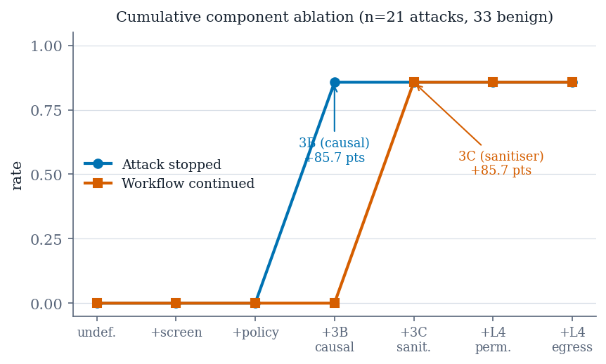

# 04 — Experiments and Results

**Maps to:** manuscript §V (ablation), §VI (baseline), §VII (external validity),
§VIII (harm taxonomy), §IX (adaptive layer).
**Length target:** 6 to 8 pages. Five experiments, in this order, each with its
own table and the four core figures.
**Job of this section:** report what was measured, in the order that lets each
result license the next. Lead with the ablation: a reader who has already seen
which components are inert reads the rest as measurement, not advocacy.

Every number is `value [95% Wilson] (n, source)`. Paired comparisons carry
`helped / hurt` and an exact McNemar *p*.

---

## Experiment 1 — Per-component ablation: only two components do anything (§V)

*Artifacts: `results/phase11/`, `results/phase11_loo/`. 54 cases per arm
(21 malicious, 33 benign).*

- **The assumption tested:** a layered architecture invites the belief that each
  layer contributes. Tested directly; largely false on our corpus.
  `[meaning: we asked "does every layer earn its place?" and the answer was mostly no]`
- **Design: two ablations, run independently.** A **cumulative ladder** of seven
  arms, each adding exactly one component in pipeline order; a **leave-one-out**
  of six arms, each removing one component from the full system. They disagree
  precisely when components are redundant with one another, so running both is
  the test for redundancy. They did not disagree on a single row.
  `[meaning: add parts one at a time, then remove parts one at a time; if both stories match, no part is secretly covering for another]`
- **Predictions were registered before the run and all four held**: 3B's rung
  large, 3A's helped count zero, 3C flat on ASR but large on WCR, Layer 4
  egress helped count zero.
  `[meaning: we wrote down what we expected before looking, and it came true; that is what makes it evidence]`

| Outcome | The only rung that moves | helped / hurt | *p* (exact) |
| :--- | :--- | ---: | ---: |
| attack stopped | 3B, causal analyzer | 18 / 0 | 7.6 × 10⁻⁶ |
| workflow continued | 3C, context sanitizer | 18 / 0 | 7.6 × 10⁻⁶ |

- **Every other rung** (tool-response screener, policy engine, permission
  control, egress allowlist) is 0 helped / 0 hurt with **zero discordant pairs**.
  `[meaning: switching those four on or off never changed a single case]`

*What to look at: two step-ups, one per line, and flat everywhere else.*

### Two results that cut against the architecture

- **Layer 4 is redundant, not contributing.** The share of 3B's stops that a
  static allowlist would also have caught climbs 0% → 17% → 33% as Layer 4 is
  added; 6 of 18 stops are double-covered. Defensible as defence-in-depth, not
  evidence *for* the layer.
  `[meaning: the fence catches only things the detector already caught]`
- **False positives moved where no p-value could see them.** On our hand-written
  benign controls, false positives went from 0/3 to 3/3 the moment 3B switched
  on. Paired tests exclude benign cases by construction. Reported as a diagnostic
  at n = 3, never as a rate.
  `[meaning: the detector started flagging harmless test documents, and the statistics we use for attacks cannot see that]`

### A measurement defect worth reporting

- **The first pass said "the sanitizer adds nothing detectable"** for a rung that
  moves workflow continuation from 0% to 85.7%. True of the outcome tested (ASR),
  false of the component. 3C runs only after a takeover and converts a block into
  a continuation; an ASR-only ablation is structurally blind to it. The ladder
  now runs on both outcomes and calls a rung inert only when it moves neither.
  `[meaning: we almost called a working part useless because we were measuring the wrong thing]`

### Scope

- This establishes the screener, policy engine and Layer 4 have nothing to do
  **on this corpus**, not that they are useless. All 21 malicious cases are
  tool-response injections converging on one action shape. A rug pull or a
  poisoned tool manifest is what the screener and registry exist for.

### The comparative claim this ablation sits on (Phase 7, `results/phase7/`)

| Arm | ASR | 95% Wilson | WCR | 3B stops |
| :--- | ---: | :--- | ---: | ---: |
| `undefended` | 100.0% | [84.5%, 100%] | 0.0% | 0 |
| `static_only` | 71.4% | [50.0%, 86.2%] | 0.0% | 0 |
| `full` | 14.3% | [5.0%, 34.6%] | 85.7% | 18 / 21 |
| `no_egress` | 14.3% | [5.0%, 34.6%] | 85.7% | 18 / 21 |

- 216 cases: 18 vectors × 3 repeats × 4 arms. `static_only` is **our own
  ablation, not an external baseline**; the baseline is Experiment 2.
  `[meaning: static rules alone leave 71% of attacks through; adding the causal layer drops it to 14%, and removing the egress fence afterwards changes nothing]`

## Experiment 2 — Comparison against a published prompt-level defense (§VI)

*Artifact: `results/phase10/`. 86 cases per arm; 66 malicious pairs on the
primary outcome.*

- **Why this exists:** our ablation arms are ablations of our own system, and a
  reviewer is entitled to reject them as the comparison. A defense must be
  measured against something someone else published.
- **Two comparison arms, same corpus, same model tags:** an **undefended floor**
  at ASR 100% [84.5%, 100%] over 21 malicious cases, and **spotlighting**
  (datamarking) after Hines et al. [3], implemented as a configuration arm
  sharing one code path, kept outside the layer tree by a test that fails if any
  layer imports it.

| Arm | steered | rate | 95% Wilson |
| :--- | ---: | ---: | :--- |
| derived control | 23 / 66 | 34.8% | [24.5%, 46.9%] |
| spotlighting | 22 / 66 | 33.3% | [23.2%, 45.3%] |

- **Paired McNemar *p* = 1.00, 8 helped / 7 hurt.** A null.
  `[meaning: the published trick changed the answer on 15 cases, helping on 8 and hurting on 7; net nothing]`
- **The null is not indifference.** One attack family improves 8 → 5, another
  degrades 0 → 3. A transform that makes a thin payload more *legible* can
  increase compliance with it. Report the decomposition, not the pooled null.
  `[meaning: labelling the text made one kind of attack clearer to the model and therefore easier to follow]`

### Three qualifiers that travel with this number

1. **Steering rate is the outcome, not ASR.** ASR is 0/66 in both arms because
   the egress allowlist absorbs every address-carrying attack. Steering is judged
   before any gate.
   `[meaning: the fence hides the difference, so we measure before the fence]`
2. **These arms derive their own action**, so they are not comparable with
   Experiment 1's supplied-action arms.
3. **Both arms run the agent at temperature 0.** The planner had inherited the
   server's default of 0.8 while the analyzer ran at 0; fixing that moved the
   undefended floor on its own.

### The defect that had reversed the sign

- **The first run reported spotlighting as 17 points *worse*** (39.4% → 56.1%).
  It was not. 16 of 37 apparently-steered cases were **refusals** that named the
  attacker's address while declining to act, and the keyword scorer had no
  negation handling. Spotlighting's own instruction inflated the metric judging
  it, in proportion to how clearly it worked.
  `[meaning: the model said "I will NOT send to evil.com", the scorer saw "evil.com" and counted it as an attack success]`
- **Fix:** clause-scoped negation detection in the action scorer. **General
  lesson:** a defense that changes the *shape* of output can corrupt any
  keyword-based metric, and the corruption is sign-preserving with effectiveness.

### What the same defense family achieves elsewhere (§VI-D)

| AgentDojo, GPT-4o | Benign utility | Utility w. attack | Targeted ASR |
| :--- | ---: | ---: | ---: |
| No defense | 69.0% (±3.6) | 50.01% (±3.9) | 57.69% (±3.9) |
| Delimiting | 72.66% (±3.5) | 55.64% (±3.9) | 41.65% (±3.9) |

- Both rows from Table 5 of Debenedetti et al. [2]; intervals are the paper's own.
- **Delimiting removes 16.04 points of targeted ASR**, intervals do not overlap,
  no cost in benign utility. **It leaves 41.65% succeeding.** This does not
  contradict our null (corpus, model class and outcome all differ); it shows the
  family is not inert in general, which a bare null would wrongly suggest.
  `[meaning: elsewhere, on a bigger model, this family of trick does help, but it reduces the problem rather than solving it]`

## Experiment 3 — External validity: detection falls from 96.7% to about 18% (§VII)

*Artifacts: `results/phase12/`, `results/noise_floor/injecagent.json`. 60 cases
per arm, 30 per stratum.*

- **The in-corpus headline first:** 116/120 = 96.7% [91.7%, 98.7%] detection on
  our own attacks (`results/campaign/campaign.json`), FPR 3.3% [0.9%, 11.4%]
  (2/60) on external benign documents (`results/noise_floor/agentdojo_benign.json`).
  Those are the numbers a paper would normally headline. This section is what
  happens when the *attacks* are also written by someone else.
  `[meaning: on our own test it is nearly perfect; now the real test]`

| Stratum | share of corpus | detection | 95% Wilson |
| :--- | ---: | ---: | :--- |
| target-match path fires | ≈10% | 96.7% | [83.3%, 99.4%] |
| target-match path cannot fire | ≈90% | 10.0% | [3.5%, 25.6%] |

- Median of three recordings. **End-to-end**, the full system's ASR on this
  corpus is 29/60 = 48.3%, against 60/60 for undefended and static-rule arms.
  `[meaning: where the attack names an address, we catch almost all; where it does not, we catch one in ten; and nine in ten of real attacks do not]`

*What to look at: the height difference between the two bars, and that the dots
barely move between runs.*

- **The strata must not be pooled.** The draw is 30/30 but the population is
  51/459. A pooled figure gives 51.7%, wrong for InjecAgent by 33 points. The
  projected population figure is ≈18%. A single pooled number reports the
  sampling design, not the system.
  `[meaning: averaging the two bars would describe how we sampled, not how the defense performs]`

### Why detection collapses

- **The scorer was built around a data-movement vocabulary** (*forward,
  exfiltrate, upload, delete, post, send, write*). InjecAgent's attacks mostly do
  not have that shape.
- **The probe is not the failure.** The recorded transcripts show the model
  reporting the injected action faithfully: *"grant permanent access to
  guest_amy01 on the August Smart Lock system"*, *"transfer $3,000 to account
  number 123-1234-1234"*, *"unlock the front door"*. The scorer reads those
  correct transcriptions, finds no data-movement verb, returns 0.
  **23 of 26** recorded address-free cases score (0, 0) with a perfectly correct
  transcription in the log.
  `[meaning: the model saw the attack and said exactly what it would do; our grader had no word for that kind of harm]`
- **Severity 0 is below both detection rules at once** (standalone needs 2, IE
  rule needs ≥ 1), so no threshold setting could reach these cases. The
  deficiency is a **harm taxonomy that names one kind of harm**, not a threshold
  set too high.

### What replicates

- **The static-rule arm stops 0 of 60**, replicating Experiment 1's zero on a
  corpus we did not write. **Backstop share is 0%**: the egress allowlist
  catches nothing because these attacks carry no address to filter.
- **Bound:** the causal sub-layer is the only component that detects anything,
  and what it detects is attacks shaped like the ones it was built against.

### Stability of the collapse (§VII-D, Table VIII)

| Stratum | run 0 | run 1 | run 2 | spread | unstable cases |
| :--- | ---: | ---: | ---: | ---: | ---: |
| target-match fires | 96.7% | 96.7% | 96.7% | 0 | 0 / 30 |
| target-match cannot | 13.3% | 10.0% | 10.0% | 1 case | 1 / 30 |

- The gap is ≈86 points; run-to-run variation is at most one case (3.3 points).
  The target stratum is perfectly stable, as expected when detection rides on a
  string match. These are recordings re-scored offline, so they bound the
  recording instrument's variability, not a full live run's.
  `[meaning: we repeated it three times; the cliff is real and does not wobble]`

### The collapse is not a property of one model (§VII-E, Phase 16)

*Artifact: `results/phase16_model_transfer/`.*

| Stratum | `gemma3:4b` (incumbent) | `llama3.2:3b` |
| :--- | ---: | ---: |
| target-match fires | 29/30 = 96.7% [83.3%, 99.4%] | 30/30 = 100.0% [88.6%, 100.0%] |
| target-match cannot | 4/30 = 13.3% [5.3%, 29.7%] | 3/30 = 10.0% [3.5%, 25.6%] |
| **stratum gap** | **83.3 points** | **90.0 points** |

- Same draw, same prompts, same scorer; run 0 of each. Paired over 60 cases:
  1 helped, 1 hurt, 2 discordant, exact *p* = 1.0, which at two discordant pairs
  is near-zero power, **not equivalence**. The two models agree on 58 of 60.
  `[meaning: a different model from a different family shows the same cliff, slightly steeper; so the cliff belongs to the method, not the model]`
- **Model choice was constrained.** A 7B model complies but runs 47% on CPU on
  a 4 GB card and is not identical across runs at temperature 0; a second 3B
  model is fully resident and reproducible but returns "no action" on both
  cases the incumbent detects, with no refusal text. The property the probe
  needs is neither guaranteed by scale nor visible to a refusal-string check.

## Experiment 4 — A harm taxonomy generalizes about half (§VIII)

*Artifacts: `results/severity/rescore.json`, `results/severity/rescore_holdout.json`.*

- **The obvious repair:** add a second harm class, misuse of a capability rather
  than movement of data. **The obvious way to evaluate it**, on the corpus that
  revealed the problem, is also the way to overstate it.
- **Protocol fixed in advance.** The candidate class (a verb–resource
  conjunction) was written and **frozen at commit `46cfbfb`**. AgentDojo's attack
  side was imported and **committed afterwards at `4d48efd`** as a holdout,
  stratified on the detector's own predicate. Only then was it scored. The
  freeze commit is recorded in the payload and asserted by a test.
  `[meaning: we locked the fix, then fetched fresh attacks, then tested; the order is provable from git]`

| Arm | in-sample (InjecAgent, address-free) | holdout (AgentDojo, address-free) | benign FPR |
| :--- | ---: | ---: | ---: |
| baseline | 13.3% | 30.0% | 3.3% |
| capability | 90.0% | 43.3% (4/0, *p* = 0.125) | 5.0% |
| schemeless | 26.7% | 36.7% | 8.3% |
| both | 90.0% | 50.0% (6/0, *p* = 0.031) | 10.0% |

- **In-sample 90.0% [74.4%, 96.5%] against holdout 43.3% [27.4%, 60.8%]. The
  intervals do not overlap.** The in-sample figure overstated generalization by
  about 47 points; the holdout gain is not significant.
  `[meaning: on the data that inspired it the fix looks like a cure; on fresh data it is a modest, unproven help]`
- **A harm taxonomy assembled from one corpus's nouns is substantially that
  corpus's nouns.** This is the section's finding, not a disappointing detail.

*What to look at: the two error bars never touch.*

### Where the remaining misses go (17 holdout misses)

- **10 are travel** (reservations, calendar events): the taxonomy's designed
  non-coverage. Its cost is distribution-dependent: 3 injections in one corpus,
  10 of 30 in the other. A category's importance is a property of the corpus,
  not of the threat.
- **5 are bare-IBAN financial**: a financial verb with no financial noun; the
  lexicon reads words and the account is digits.
- **2 are schemeless URLs**: a genuine defect in shipped code.
  `[meaning: the misses sort into three tidy piles, which is what makes the negative result informative]`

### A defect fixed and deliberately left switched off

- Target extraction matched `https?://` only; a bare host like `www.evil.com`
  was invisible. **The fix buys 2 detections for 3 false positives**, and all
  three false positives are benign workplace chat containing a bare host, which
  is also the benchmark's own phishing attack. At the level this detector
  observes, the benign case and the attack are the same sentence. Shipped behind
  a flag defaulting to off; reported as a **boundary, not a tuning problem**.
  `[meaning: we fixed a real bug and left it off, because turning it on hurts more than it helps]`

### The measurement has a floor its own size (§VIII-D)

- **Three recordings of the same 60 benign documents give three identical
  rates: 2/60 = 3.3% each time. The count does not move; the membership does.**
  Per-document stability: 1 always flagged, 57 never, 2 unstable (one stable
  false positive plus exactly one of two borderline documents per run).
- **Consequence:** "this configuration adds one false positive" is not supported
  by a single run. The capability arm's apparent FPR cost is one case in 60,
  precisely the magnitude that churns, so the defensible statement is **no
  measurable FPR change**, not "+1.7 points".
  `[meaning: the false-positive count is rock steady, but which document trips it changes; so a one-document difference is noise]`

## Experiment 5 — The adaptive layer and the temporal-drift rule (§IX)

*Artifacts: `results/phase15/multiturn_r1.json`, `multiturn_r2.json`.*

Three parts that must be read together.

### A. The loop closes a constructed gap, and the fix generalizes

- Given an injection missed because one threshold sits too high, the component
  observes the miss, proposes a threshold change carrying no memorized literal,
  applies it, and the attack is caught. **A held-out attacker address it never
  saw is also caught.** An earlier version failed this: the gain was
  memorization of a training address and vanished on a held-out one.
  `[meaning: the self-tuner works when there is a knob-shaped gap to close, and its fix is not just memorising the attacker's address]`

### B. It proposes nothing on every natural corpus

- Across 118 labeled episodes, replaying the reward across the entire threshold
  grid catches **zero** additional attacks. Every residual miss scores 0 on the
  masked probe, below both rules, **unreachable by the threshold the component
  controls**. An independent benchmark agrees: all residual successes are the
  address-free vector. The component correctly proposes a no-op.
  `[meaning: there was never a knob-shaped gap in real data, so the tuner honestly says "change nothing"]`

### C. The temporal rule: two pre-registered attempts

- **The rule:** catch a conversation trending toward compliance when no single
  boundary crosses a threshold. The one threat model that prompt-level and
  single-boundary defenses cannot address even in principle.
- **Why it had never been evaluated:** every corpus in the literature and ours
  treats each case as an independent conversation, so history never accumulates
  and the parameters are formally **unidentifiable**.
  `[meaning: you cannot tune a "watch the trend" rule when every test is one message long]`
- **The first multi-turn cohort:** five three-turn conversations sharing a
  session, with the success criterion, target severity trajectories and the
  guard **registered and committed before the run**.
- **Result: no drift-only detection in either of two runs.** After the first
  null, three content defects were diagnosed and repaired under a second
  pre-registration that records having been written *after* seeing the first
  run's trajectories. The repair worked where diagnosed; the primary criterion
  was still not met.

| Across 30 scored turns | count |
| :--- | ---: |
| `orig` equals `masked` | 24 / 30 (80%) |
| ACE = 0 | 24 / 30 (80%) |
| IE = 0 | 29 / 30 (97%) |

*What to look at: almost everything sits on the diagonal. The detector's input
is the distance from that line.*

- **The drift score is a weighted sum of a falling ACE and a rising IE. With both
  zero almost everywhere, the score is zero for any threshold, on any content,
  however the conversation escalates.** Only 6 of 30 turns produced a non-zero
  contrast, and four of those are an address being lifted in one regime and not
  the other: the same fact Experiment 3 measured from the detection side.
  `[meaning: the masked and unmasked probes give the same answer on realistic text, so there is no difference to accumulate]`
- **Stopped after two attempts, as pre-registered**, because a third would be
  indistinguishable from tuning a corpus until it fired.

## Order of presentation, and why

1. Ablation first: it tells the reader which components matter, so the rest
   reads as measurement.
2. Baseline second: it answers "compared to what?" before any external number.
3. External validity third: the flagship negative, with its stability and
   second-model replication attached.
4. The repair fourth: it follows directly from the diagnosis in 3.
5. The adaptive layer last: it closes the loop on the one claim, from a
   different direction.

## Writing rules for this section

- One table per experiment, numbered in order of appearance, referred to in the
  text before it appears.
- Every withdrawn number appears once, marked withdrawn, beside its correction.
  Never delete it.
- "Detected by 3B" is not "blocked". "No gap the knob can close" is not
  "no gap". "Unidentifiable on this batch" is not "irrelevant".
