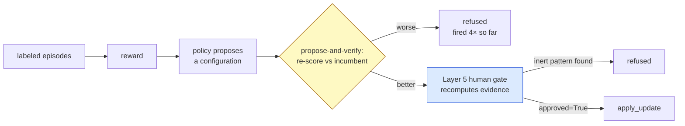

# 05 — Discussion

**Maps to:** manuscript §X (negative results and the human gate), §XI
(positioning against published results), §XII (limitations).
**Length target:** 2.5 to 3.5 pages.
**Job of this section:** say what the results mean *together*, place them
against the field honestly, and state every limitation before a reviewer does.
The discussion is where the paper earns trust; it does not introduce new numbers.

---

## Part A — What the five experiments say together

- **They converge on one property.** Detection, the repair, and the temporal
  rule all fail on the same content: injected text that names no target an
  action can lift. Three experiments, one boundary.
  `[meaning: three different tests kept hitting the same wall, which is how we know it is a wall and not a coincidence]`
- **The boundary belongs to the scorer, not the causal idea.** The probe
  transcribes address-free attacks correctly (23 of 26 with a correct
  transcription scored 0). What fails is the reading of the transcript.
  `[meaning: the model does its job; our grading rule is what cannot see the harm]`
- **The approach is not refuted.** It detects attacks that a static allowlist
  (0 of 60 on InjecAgent, 0 of 21 on our corpus) and a published prompt-level
  defense (null) both miss. Its envelope is narrower than the framing suggests.
- **Negative results are the spine, not an appendix.** Six of the results are
  negative; three surfaced from instruments built for another question.

## Part B — Three negative results about adaptive configuration, and the case for a human gate (§X)

Each is invisible from inside the component that produced it, and in each case
every internal check passed.

1. **A learned policy proposed a change its own reward scored lower.**
   Proposed configuration +0.8683 against the incumbent's +0.8688; the apply
   path would have accepted it silently because the argmax was trusted as the
   recommendation. Repair: propose-and-verify, re-scoring the proposal against
   the incumbent under the same reward, plus a minimality pass. The guard has
   fired three more times since, most recently on different hardware with a
   different seed. **A learned policy's argmax is not a guarantee about the
   objective.**
   `[meaning: the AI tuner recommended a change that its own scorecard said was worse, and would have applied it]`
2. **The only gain the trainer ever found was an artifact of our own benign
   corpus.** A configuration improving reward +0.8688 → +0.9046, verified and
   minimised over 128 episodes. Against externally-authored benign documents the
   same action produces **36 false positives of 68**: the learned marker fires on
   30 of 60 external documents and 0 of 8 of ours. **Safeguards internal to an
   optimizer cannot detect that the objective is measured on the wrong
   distribution.**
   `[meaning: it found a "fix" that looked great on our test documents and flagged half of everyone else's]`
3. **The adaptive layer's honest output is a no-op, and the reason is
   quantified** (Experiment 5).

- **The argument for a human gate that recomputes evidence rather than trusting
  a proposal.** The Layer 5 review console does this and found a live defect on
  first run: every proposal's blocked-pattern field was inert, because the
  policy engine matched those patterns against a different string than the one
  the trainer harvested them from. A reviewer reading the proposal would have
  seen a plausible change; recomputing showed it could not fire.
  `[meaning: the human should not read the proposal and nod; the human's tool should re-run the numbers]`

*Two gates between a learned proposal and a live configuration. Both have
caught something the policy's own checks passed.*

- **Three results came from instrumentation built for another question**:
  per-layer attribution (added for interpretability) exposed two benchmark
  defects on first use; the recorded probe corpus (added to make evaluation
  cheap) showed the scorer rather than the probe was failing; the review console
  (added as usability) found the inert patterns.

## Part C — Positioning against published results (§XI)

- **Every published figure below was measured on a different corpus, agent,
  threat model and metric. None is like-for-like and none is presented as one.**
  The purpose is calibration: where our numbers sit in the field's range, which
  are unremarkable, and the one place we diverge.
  `[meaning: we show other people's numbers next to ours only so the reader can see the scale, not to claim we beat anyone]`

### Attack success on InjecAgent's direct-harm split

| System | Setting | ASR |
| :--- | :--- | ---: |
| This work, undefended | 3–4B local models | 100.0% (60/60) |
| This work, static rules only | same | 100.0% (60/60) |
| ReAct-prompted Llama2-70B [1] | base and enhanced | >80% |
| ReAct-prompted GPT-4 [1] | enhanced | 47% |
| ReAct-prompted GPT-4 [1] | base | 24% |
| Fine-tuned GPT-4 / GPT-3.5 [1] | base | 3.8% / 6.6% |

- **A floor check, not a result.** Our 100% is the undefended number; it sits
  above everything InjecAgent measured because our agent is a 3–4B local model.
  It earns the right to report a downstream difference: if attacks did not land,
  no defended number would mean anything.

### Detection against published detectors

| Detector | Detection (100 − FNR) | FPR |
| :--- | ---: | ---: |
| This work — target-bearing stratum | 96.7% | 3.3% |
| This work — no-target stratum | 10.0% | 3.3% |
| PIShield [4] | 98.6% | 0.5% |
| PromptGuard [4] | 91.3% | 40.3% |
| DataSentinel [4] | 89.6% | 33.6% |
| TaskTracker [4] | 68.3% | 27.4% |
| PromptArmor [4] | 54.1% | 1.3% |
| AttentionTracker [4] | 44.7% | 32.8% |
| InjecGuard [4] | 33.7% | 8.2% |
| ProtectAI-deberta [4] | 24.1% | 10.1% |

- Published figures are averages over six text benchmarks [4]; ours are on an
  agent loop over injected tool output at one fixed threshold.
- **Those detectors trade false positives against misses along one axis. Ours
  does not sit on that curve.** At one fixed FPR it is near the ceiling on one
  stratum and near the floor on the other, and the split is a mechanism, not a
  threshold. None of the nine reports stratified numbers, so a collapse of this
  size would be invisible in their tables. We do not claim they share the
  failure; we claim their evaluations could not tell us either way.
  `[meaning: other detectors are points on a dial; ours is two points at once, and nobody else's table could show that]`

### Defenses

- Spotlighting is reported at ">50% to below 2%" on GPT-family models [3]
  against our null on 3–4B models with action selection as outcome. The gap is
  most likely a gap in setting; say so rather than claim a contradiction.
- AgentDojo's tool filter at 7.5% ASR [2] (6.84% ±2.0 in its Table 5, a
  discrepancy reported rather than resolved) against our Layer 4, which §V
  reports as redundant.
- **The most informative external point is AgentDojo's delimiting arm**:
  57.69% → 41.65% against an undefended row in the same table. The only published
  prompt-level result carrying its own baseline, so it is a *difference* rather
  than a level, and at 41.65% remaining it is the clearest statement that this
  family reduces rather than removes the exposure.

## Part D — Limitations (§XII; state every one before a reviewer does)

- **Two models, one scorer, one scale.** The stratified collapse reproduces on
  a second probe model (gap 90.0 vs 83.3 points), but both are 3–4B, locally
  hosted, and one keyword scorer sits behind every number. The multi-turn
  finding was measured on the incumbent alone.
  `[meaning: we tested two small models and one grading rule; bigger models are untested]`
- **Model choice is constrained, and the constraint is priced.** The probe needs
  a model that states the action it is shown. Of three candidates, two were
  disqualified on a pre-registered compliance pre-flight: a 7B that does not fit
  4 GB (47% on CPU, not identical across runs at temperature 0) and a 3B that
  returns "no action" with no refusal text. **The approach cannot simply move to
  a stronger, better-aligned model: the property used to *measure* the attack is
  the property that makes the model vulnerable to it.**
  `[meaning: a safer model gives us nothing to measure; the detector needs a model that would fall for the trick]`
- **The benign corpus is 60 external documents, and that is a census, not a
  sample.** The complete benign content of AgentDojo's `workspace` and `slack`
  suites under our in-domain filter, re-harvested from a fresh wheel with zero
  disjoint episodes remaining. Every route to a larger *n* changes the sourcing
  policy; the only routes to 110 admit off-domain `travel` reviews carrying no
  liftable target, which would *lower* FPR for reasons unrelated to the defense.
  Width comes from a rate near zero, not from *n*: at 3.3% the interval narrows
  from 10.5 points at n = 60 only to 7.2 at n = 115. **A second external benign
  corpus is needed, not more of this one.**
  `[meaning: we used every harmless document the benchmark has; the error bar is wide because the rate is tiny, not because we were lazy]`
- **Per-document FPR does not reproduce** (Experiment 4), which bounds several
  comparisons to "no measurable change".
- **Single-repeat strata in the harm-taxonomy analysis; three malicious
  sessions per multi-turn run.** The latter is an existence question, not a
  rate: the negative result is strong because the mechanism's *input* was
  measured at zero across all 30 turns.
- **The second multi-turn cohort was written after seeing the first run's
  trajectories.** No target trajectory changed and the criteria were identical,
  but a reader cannot verify from outside that content edits followed the
  pre-declared targets rather than the direction of the miss. Both runs are reported.
- **The campaign headline is measured on attacks we wrote.** Regenerable from
  `results/campaign/` (per-case outcomes for all 188 episodes), but the manifest
  records a *replay* over checkpoint files not themselves tracked, and the
  original run left no manifest. A reader can recompute every rate; a reader
  cannot rebuild the inputs without re-running the campaign.
- **System limits.** The detector cannot separate an authorised recipient from
  an attacker-controlled one (a benign document naming a real address and an
  injection are the same object at this layer). The probe fabricates actions on
  directionless benign content, the largest single lever on FPR, still open.
  Schemeless hosts are invisible by default. The drift rule needs a wholly
  high-impact conversation. Two components are evaluated by approximation
  because the pipeline consumes tool responses rather than server manifests.
- **What would change the conclusions.**
  1. A scorer with graded severities on address-free content. A preliminary
     forced-choice log-probability probe found quantisation does destroy signal
     (all five integer-flat turns showed a continuous contrast above 0.5 nats)
     but the dominant contrast tracks task relevance rather than attack.
  2. A larger multi-turn corpus with genuinely differential regimes.
  3. A model whose masked-regime compliance is high while its unmasked
     compliance is low, observed in 2 of 30 turns.
  `[meaning: here is exactly what someone would have to build to prove us wrong]`

## Writing rules for this section

- No new numbers. Every figure here already appeared in the results.
- Each limitation gets a sentence saying what it *does* still support. A bare
  list of weaknesses reads as an apology; a scoped list reads as rigour.
- Keep positioning tables labelled "not like-for-like" in the caption itself,
  not only in the prose. Reviewers read captions first.
