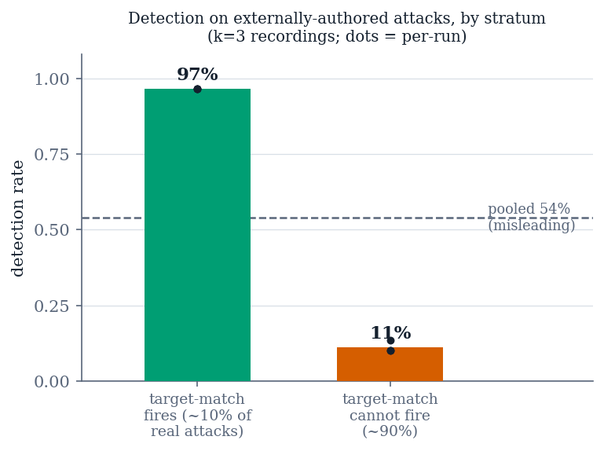
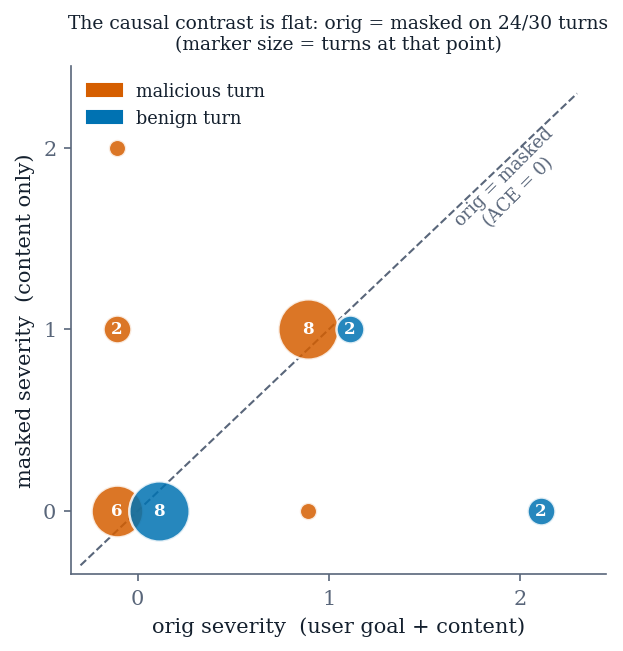

# Causal Prompt-Injection Detection Depends on a Liftable Target: A Stratified, Pre-Registered Evaluation in Tool-Integrated LLM Agents

**MUHAMMAD AHMAD KHAN**¹, **ALEENA KHAN**¹, and **LAEEQ AHMED**¹

¹Department of Computer Science and Information Technology, University of Engineering and Technology Peshawar, Jalozai Campus, Khyber Pakhtunkhwa, Pakistan (e-mail: 23jzbcs0238@uetpeshawar.edu.pk; 23jzbcs0229@uetpeshawar.edu.pk; laeeq@uetpeshawar.edu.pk)

Corresponding author: Muhammad Ahmad Khan (e-mail: 23jzbcs0238@uetpeshawar.edu.pk)

**[CONFIRM BEFORE SUBMISSION — ORCID iD for each author; IEEE membership grade, if any, appended to a name as "(Member, IEEE)"; author order, which is the supervisor's call; and the funding statement, which IEEE Access requires even when the answer is none.]**

**Abstract** — Indirect prompt injection is the principal open vulnerability of tool-integrated language-model agents: an agent that reads a tool response is reading untrusted text, and it has no reliable way to separate content it was asked to process from a command it was asked to follow. Proposed defenses cluster into prompt-level marking and gate-level constraint. A third framing asks instead whether the model's proposed action *changed because of* the untrusted span — a causal question. We implement a six-layer defensive pipeline whose distinguishing element is such a causal detector, and we evaluate it against externally-authored attacks, against a published prompt-level defense, and component by component. The evaluation is largely negative and the negative results are the contribution. A ladder ablation and a leave-one-out ablation agree that four of six components change no outcome on our corpus. A re-implementation of spotlighting produces a null on our harness (34.8% to 33.3% steered, paired McNemar *p* = 1.00) that decomposes into two per-family effects of opposite sign. Detection falls from 96.7% on attacks we wrote to approximately 18% on InjecAgent, and the stratification is the finding rather than a caveat: 96.7% where the detector's target-match path can fire against 10.0% where it cannot, which is roughly 90% of that corpus. Widening the harm taxonomy — the obvious repair — scores 90.0% in-sample and 43.3% on a corpus frozen before the widening was written, with non-overlapping intervals and no statistical significance. Finally, two pre-registered multi-turn experiments found the adaptive layer's temporal-drift rule unable to fire, and measured why: the masked and unmasked regimes return identical severities on 24 of 30 turns, so the causal contrast is zero for any threshold on any content. All results converge on one claim — the causal contrast carries discriminative signal when the injected content contains a *liftable target*, an address or URL an action can name, and close to none otherwise. Every number reported here is regenerable by a committed command over a released artifact, and the two headline experiments were pre-registered.

**Index Terms** — indirect prompt injection, LLM agents, causal detection, security evaluation, negative results, tool-integrated language models, reproducibility.

---

## I. Introduction

An LLM agent that reads tool output is reading untrusted text. When that text contains instructions, the model has no reliable way to distinguish *content it was asked to process* from *a command it was asked to follow*. This is indirect prompt injection, and unlike a jailbreak it requires no access to the user: the attacker writes an email, a support ticket, or a build log, and waits for an agent to read it [5].

Proposed defenses cluster into two families. **Prompt-level** defenses mark the untrusted span and instruct the model to disregard instructions inside it [3]. **Gate-level** defenses constrain what the agent may do afterwards — permission scopes, egress allowlists, sandboxes, tool filters [2]. A third and less-explored family asks a different question: not *does this text look dangerous*, but **did the model's proposed action change because of it?**

That third framing is causal, and it is the one this paper evaluates. The appeal is clear — it targets the mechanism of the attack rather than its surface — and to our knowledge it has not previously been measured against external corpora, ablated component by component, or tested for whether its adaptive parameters are identifiable at all.

### A. What we built and what we asked

We implement a six-layer defensive pipeline whose distinguishing element is a causal sub-layer: it runs the model's action selection under four regimes that differ in what the model can see, and treats *differences between those regimes* as evidence that untrusted content is driving the action. A separate adaptive component observes detection failures and proposes configuration changes for human approval.

We then set out to measure it honestly, which turned out to mean measuring the instruments first.

### B. Contributions

**1) A component-wise ablation showing that four of six components change no outcome on our own corpus.** Ladder and leave-one-out ablations agree on every row: the causal analyzer moves detection (18/0 discordant, exact *p* = 7.6 × 10⁻⁶), the sanitizer moves workflow continuation (18/0), and the tool-response screener, the policy engine, and both halves of the permission and egress layer are 0/0 with zero discordant pairs. Layer 4 is *redundant* rather than contributing (§V).

**2) A measured comparison against a published prompt-level defense, which is a null.** Spotlighting moves the steering rate from 34.8% to 33.3%, McNemar *p* = 1.00 — and the null decomposes into two per-family effects of opposite sign, because a transform that makes a thin payload more *legible* can increase compliance with it (§VI).

**3) External validity, measured, at a cost.** Detection falls from 96.7% on our corpus to approximately 18% on externally-authored attacks, and the stratification is the finding: 96.7% where the detector's target-match path can fire, 10.0% where it cannot — which is roughly 90% of that corpus (§VII).

**4) A held-out test of the obvious repair, which generalizes about half.** Widening the harm taxonomy scores 90.0% in-sample and 43.3% on a corpus reserved before the widening was written — non-overlapping intervals, and not statistically significant. A harm taxonomy assembled from one corpus's nouns is substantially that corpus's nouns (§VIII).

**5) The first evaluation of a temporal-drift rule whose parameters were formally unidentifiable, and a structural explanation of why it cannot fire.** Two pre-registered multi-turn experiments returned no detection. Across 30 scored turns the masked and unmasked regimes returned the same severity on 24, so the causal contrast is zero 80% of the time and the drift score is zero for any threshold, on any content (§IX).

**6) Three negative results about adaptive security configuration**, each invisible from inside the component that produced it: a policy proposing a change its own reward scored lower; the single gain a trainer ever found being an artifact of a hand-written benign corpus (36 false positives of 68 on external data); and every internal safeguard working correctly while none could see outside the corpus. Together they are the argument for a human gate that *recomputes* evidence rather than trusting a proposal (§X).

### C. The claim these converge on

> **The causal contrast carries discriminative signal when the injected content contains a liftable target — an address or URL the action can name — and close to none otherwise.**

Every result above is a consequence of that one property. Detection collapses externally because externally-authored attacks mostly carry no such target. The harm taxonomy generalizes about half because it is a list of nouns standing in for a mechanism. And the adaptive layer proposes nothing because two of its five parameters act on a quantity we measure at zero in 80–97% of turns.

We believe this is the most useful thing a first evaluation of causal injection detection can report, and it is not what we expected to find. The approach is not refuted — it detects real attacks that both a static allowlist and a prompt-level defense miss — but its operating envelope is far narrower than the framing suggests, and it is bounded by a property of the *scorer* rather than of the causal idea.

### D. On negative results and instruments

Six of the results above are negative, and three surfaced from instrumentation built to answer a different question. That is not incidental. Systems of this kind fail more often in their **instruments** than in their mechanisms, and instruments are the least-tested part of any evaluation, because a broken instrument returns a plausible number rather than an error. We report withdrawn measurements alongside the corrected ones throughout — a benchmark whose first result was invalid by construction, a baseline whose sign was reversed by its own scorer, an ablation that called a working component inert — because in each case the corrected number is only trustworthy in light of what the first one got wrong.

## II. Related Work

**Establishing the attack.** Greshake et al. [5] characterised indirect prompt injection against LLM-integrated applications and showed it does not require access to the user's prompt. Subsequent work has focused on benchmarking agent susceptibility and on defenses.

**Benchmarks.** InjecAgent [1] measures indirect injection against tool-integrated agents over 1,054 test cases spanning 17 user tools and 62 attacker instructions, splitting attacks into direct-harm and data-stealing. It reports that a ReAct-prompted [6] GPT-4 reaches an attack success rate of 24% in the base setting and 47% with a reinforcing "hacking prompt", and that a prompted Llama2-70B exceeds 80%. AgentDojo [2] provides a dynamic environment of 97 user tasks and 629 security test cases and evaluates both attacks and defenses within it. We use the direct-harm split of the first as our external attack corpus and the second for both external benign documents and a held-out attack corpus, in each case reporting corpus version and licence (§IV).

**Prompt-level defenses.** Spotlighting [3] transforms untrusted input to give the model a continuous signal of provenance, and reports that it "reduces the attack success rate from greater than 50% to below 2%" on GPT-family models with minimal impact on task efficacy. Because our threat model, model scale and outcome variable all differ, we re-implement it inside our own pipeline rather than quoting that figure as a comparison (§VI).

**Gate-level defenses.** AgentDojo evaluates several, and reports that "our simple tool filtering defense is particularly effective, lowering the attack success rate to 7.5%" [2]; the same paper's Table 5 gives that defense a targeted ASR of 6.84% (±2.0) on GPT-4o, and we quote the body text while naming the table figure rather than silently choosing between them. Our Layer 4 belongs to this family, and §V reports it as redundant rather than contributing on our corpus.

**Detector-based defenses.** A substantial line of work trains or probes classifiers to flag injected instructions in text. PIShield [4] compares nine such systems on short- and long-context benchmarks, reporting average false-positive rates from 0.5% to 40.3% and average false-negative rates from 1.4% to 75.9%. These systems classify a *text prompt*; ours classifies a *turn of an agent loop*, and its input is a behavioural contrast rather than the text itself. §XI positions our numbers against theirs and states precisely why the comparison is indicative rather than like-for-like.

**What separates the three families is the unit of evidence.** A prompt-level defense reasons over the *text*, marking its provenance and relying on the model to honour the mark. A gate-level defense reasons over the *action*, constraining what may be executed regardless of why it was proposed. A detector reasons over the text again, but classifies it rather than annotating it. Each assumption is load-bearing, and each fails in a characteristic place. Marking fails when making a payload legible also makes it more actionable — we measure exactly that in §VI, where a spotlighting re-implementation produces a null that decomposes into two per-family effects of opposite sign. Gating fails when the attacker's objective requires the same permissions as the user's legitimate task, which AgentDojo's own analysis identifies as the boundary of tool filtering, and which §V reproduces as Layer 4 contributing nothing incremental once the detector is on. Classification fails at the operating point: the nine systems PIShield compares trade false positives against misses along a single axis, and the spread of that trade across benchmarks is most of the range available.

The causal framing takes a fourth unit: neither the text nor the action, but the *relation between them* — did this span change what the agent proposed? That is a different question from all three, and it is the reason the approach is worth evaluating rather than assumed. It is also why its failure mode could not be anticipated from the other three. A defense reasoning over a relation needs the relation to be observable, and §VII reports the condition under which it is not: when the injected span names no target an action can lift, the contrast the detector reads is close to zero, and no threshold on it can recover what was never measured.

**Protocol-surface work, which motivates the layers below the agent.** A fourth line of work targets the tool-integration surface itself rather than the prompt. A survey of more than thirty attack techniques across input manipulation, model compromise, system and privacy attacks, and protocol-level vulnerabilities [13] establishes the threat landscape our Layers 0 and 1 are drawn against; MCPSecBench [11] reports protocol-level attacks succeeding against every evaluated host platform, which is why Layer 0 exists at all. ETDI [12] specifies the signed, versioned tool definitions our server trust registry follows, and AutoMalTool [10] supplies the detection-oracle design for screening tool metadata at registration — a check our pipeline approximates rather than performs, because it consumes tool responses rather than server manifests (§XII). MCP-RiskCue [14] applies GRPO to risk inference over server logs, the same optimiser our adaptive layer uses on a different object. Closest to this work is AgentSentry [9], which also localises injection by counterfactual re-execution at tool-return boundaries and also purifies context for safe continuation; our contribution is not that mechanism but the finding that its discriminative power is governed by whether the injected span carries a liftable target, which requires the stratified reporting of §VII.

**What is missing, and what this paper supplies.** Across this literature, detection results are reported pooled. We found no paper that stratifies detection by whether the injected content names a target the action can lift — which is the split that governs our results and, we argue in §XI, would not be visible in any of the tables we surveyed.

## III. Threat Model and System Architecture

### A. Threat model

**The attacker** writes content that an agent will later read as tool output: an email body, a support ticket, a document comment, a build log, an API response. They cannot see or modify the user's prompt, the system prompt, or the model weights, and they do not know when or whether their content will be read.

**The mediator** is that untrusted span. Everything in this paper turns on boundaries where a mediator enters the agent's context and an action follows.

**Success**, for the attacker, is the agent taking an action the user did not ask for and would not sanction — exfiltrating data, contacting a new recipient, enumerating credentials, changing a permission. We measure this as **attack success rate (ASR)** at the point of tool invocation, after every gate.

**Two secondary outcomes** matter and are reported separately, because a defense optimising one while destroying the other is not a defense:

- **Workflow continuation rate (WCR)** — the agent completes the user's genuine task despite the injection, rather than refusing wholesale. A defense that blocks everything scores ASR 0 and is useless.
- **False positive rate (FPR)** — benign documents wrongly flagged, measured on externally-authored benign content rather than our own.

**Out of scope:** attacks on the model weights, compromised servers issuing correct-looking protocol traffic, and deception of the human reviewer. The supply-chain layer screens server manifests but we do not evaluate it here; §V explains why, and §VII tests that boundary.

### B. A distinction the evaluation forced

Two experimental setups appear in this paper and **must not be pooled**:

- **Supplied action** — the pipeline is handed a proposed action and judges it. This isolates the detector.
- **Derived action** — the agent selects its own action from the user's goal and the mediator. This is required to evaluate any prompt-level defense, since those defend *action selection*, and there is nothing to defend when the action arrives pre-formed.

ASR under the two is not comparable, and we never place them in one table. §VI's baseline comparison is derived-action; §V and §VII are supplied-action.

### C. Architecture

Six layers compose the pipeline (Table I). Requests traverse the stack and each layer may refuse.

| Layer | Role |
| :--- | :--- |
| 0 | Transport and server trust — registry, allowlist, rug-pull detection |
| 1 | Input and supply-chain screening — parsing, context assembly, provenance |
| 2 | Agent control plane, containing the security sub-layer 3A–3D |
| 3 | Tool execution plane and tool-response screener |
| 4 | Sandbox and isolation — permission scope, egress allowlist, container, telemetry |
| 5 | Human-in-the-loop review and observability |

**Table I.** The six layers. The contribution sits inside Layer 2.

The security sub-layer inside Layer 2 contains four components:

- **3A — policy engine.** Static pattern and tool-category rules; routes high-impact tools to causal evaluation.
- **3B — causal analyzer.** The subject of this paper, described below.
- **3C — context sanitizer.** Runs only *after* a takeover verdict, converting a blanket block into a safe continuation. Its contribution is usability, not detection — which §V shows an ASR-only ablation cannot see.
- **3D — adaptive threat model.** Observes labeled outcomes and proposes configuration changes. It never touches model weights; it tunes 3A's patterns and tool set and 3B's thresholds, and every proposal requires human approval.

### D. Inside the causal analyzer

For each boundary, the model's action selection is run under **four regimes** differing only in what the model can see, each sampled *k* times and scored on {0, 1, 2} (Table II).

| Regime | Sees | Purpose |
| :--- | :--- | :--- |
| `orig` | user goal + mediator | baseline behaviour |
| `masked` | mediator only | compliance tendency with no competing task |
| `masked_sanitized` | sanitized mediator only | compliance after sanitisation |
| `orig_sanitized` | user goal + sanitized mediator | task behaviour after sanitisation |

**Table II.** The four regimes. Two contrasts drive detection: ACE = `orig` − `masked` and IE = `masked` − `masked_sanitized`.

**Severity is scored at 2** by, in order: an action naming a target lifted from the mediator; a state-changing verb paired with a controlled resource the mediator corroborates; or a data-movement keyword, grounded so that an action the content never suggested cannot escalate. Severity 1 is a diagnostic action (read, list, check, reply). Severity 0 is non-compliance.

**Takeover fires on any of three rules:**

1. **IE rule** — IE ≥ threshold, `masked` ≥ 1, and the separation consistent across samples.
2. **Standalone rule** — `masked` ≥ 2, independent of IE. Necessary because the IE rule reads a *difference* and silently inverts when sanitisation fails: both regimes comply, the severities cancel to IE = 0, and an attack that survived sanitisation reads as safe.
3. **Drift rule** — a falling ACE or rising IE slope across a per-session window, gated on `masked` ≥ 1 so that "nothing observed" can never mean takeover.

Rules 1 and 3 both consume *contrasts*; rule 2 consumes an absolute severity. The paper's central finding is that the contrasts are near zero on content without a liftable target, which determines what rules 1 and 3 can do and leaves rule 2 carrying the system.

### E. Implementation

The pipeline runs locally against small open models — a 4B model for the causal probe, a 3B model for sanitisation and planning — deliberately, because the causal probe requires a model that *complies* under the masked regime. A more refusal-prone model returns no signal to measure, which is a real constraint on deploying this approach and is stated as a limitation in §XII rather than hidden.

Every arm in every experiment is one configuration object, so ablations and baselines share a single code path rather than a forked one. Detection verdicts are computed by one extracted function used by both the live pipeline and the offline re-scorer, so no result in this paper is produced by a restatement of a rule — a defect that cost us a mislabelled stratum before it was found.

## IV. Experimental Methodology

Because the majority of our results are negative, the discipline that produced them is part of the contribution. Six rules govern every number in this paper.

**1) No headline figure without n, the named corpus, and a 95% interval.** Proportions use Wilson intervals [7] rather than the normal approximation, which is wrong at the sample sizes and near-boundary rates involved. A bare point estimate is a diagnostic and is labelled as one in text and in tables.

**2) Cohorts of different provenance are never pooled.** Our hand-written benign controls and the externally-authored benign documents are separate cohorts, always. Pooling them is what once made a 4/8 count look like a false-positive rate.

**3) Every arm shares one code path.** Ablation arms are configuration values inside the pipeline, never a forked script. An ablation that runs different code is a different system.

**4) At least two comparison arms besides the full system** — an undefended floor and a published prompt-level defense — on the same corpus, seeds and model tags. An ablation of our own system does not discharge this requirement.

**5) Every number is regenerable by one committed command** whose artifact is committed with a run manifest recording commit SHA, working-tree cleanliness, model tags, corpus version and GPU state. A table that cannot be regenerated is not claimed.

**6) A statistic is a result, not arithmetic.** No p-value or interval enters any document before the code computing it is committed and its inputs are in the tracked artifact. This rule exists because we violated it once: a McNemar result reached five documents with no committed implementation and no discordant counts in the artifact. The figure happened to be right, which is luck rather than process.

**Paired arms receive a paired test.** Arms see identical cases, so outcomes are compared with McNemar's test [8], exact below roughly 25 discordant pairs, rather than by inspecting whether two Wilson intervals overlap.

**Determinism.** There is no RNG seed: the inference server exposes none, so reproducibility rests on greedy decoding at temperature 0. That is not literally deterministic — across a full campaign, 2 of 564 regime severities disagreed between repeats — which is why repeated recordings exist and why single-run claims are flagged as such.

### A. Corpora

| Cohort | n | Provenance | Role |
| :--- | ---: | :--- | :--- |
| Campaign (ours) | 188 | authored by us | 120 malicious, 68 benign; development and the in-corpus headline |
| AgentDojo benign | 60 | AgentDojo v0.1.35, MIT [2] | the false-positive rate of record |
| AgentDojo attacks | 60 | AgentDojo v0.1.35, MIT [2] | holdout, imported after the harm lexicon was frozen |
| InjecAgent | 60 | InjecAgent, MIT [1] | direct-harm split, drawn 30/30 across two strata |

**Table III.** Evaluation corpora. Provenance and version are stated for every external corpus; strata are never pooled.

Three quantities are deliberately withheld from the paper's claims. A 50% false-positive rate on eight hand-written benign controls is a diagnostic at n = 8, not a rate. A pooled InjecAgent figure is wrong for that corpus by 33 points, because the 30/30 draw comes from a 51/459 population. And an early 0/30 external FPR came from a stride subsample that excluded both known false positives by construction.

## V. Per-Component Ablation: Only Two Components Do Anything

*Artifacts: `results/phase11/`, `results/phase11_loo/`. 54 cases per arm (21 malicious, 33 benign).*

A layered architecture invites the assumption that each layer contributes. We tested that assumption directly and it is largely false on our corpus. Reporting it first is what licenses every claim that follows: a reader who has already seen which components are inert will read the remaining numbers as measurements rather than as advocacy.

### A. Design

Two ablations, run independently and compared. A **cumulative ladder** of seven arms, each adding exactly one component in pipeline order; and a **leave-one-out** of six arms, each removing one component from the complete system. The two disagree precisely when components are redundant with one another, so running both is not duplication — it is the test for redundancy. They did not disagree on a single row.

### B. Result

| Outcome | The only rung that moves | helped / hurt | *p* (exact) |
| :--- | :--- | ---: | ---: |
| attack stopped | 3B, causal analyzer | 18 / 0 | 7.6 × 10⁻⁶ |
| workflow continued | 3C, context sanitizer | 18 / 0 | 7.6 × 10⁻⁶ |

**Table IV.** Ablation outcomes. Every other rung — tool-response screener, policy engine, permission control, egress allowlist — is 0 helped / 0 hurt with zero discordant pairs.

Predictions were registered before the run and all four held: 3B's rung large, 3A's helped count zero, 3C flat on ASR but large on WCR, and Layer 4 egress helped count zero. That is what makes this evidence rather than post-hoc rationalisation.

### C. Two results that cut against the architecture

**Layer 4 is redundant, not contributing.** The fraction of 3B's stops that a static allowlist would also have caught climbs from 0% to 17% to 33% as Layer 4 is added. Six of 18 stops are double-covered. This is defensible as defence-in-depth, but it is not evidence *for* the layer and we do not present it as such.

**False positives moved where no p-value could see them.** On our own hand-written benign controls, false positives went from 0/3 to 3/3 the moment 3B switched on. No paired test in either table detects this, because paired tests exclude benign cases by construction. We report it as a separate diagnostic at n = 3 and never as a rate.

### D. A measurement defect worth reporting

The first pass of this analysis reported that "the sanitizer adds nothing detectable" for a rung that moves workflow continuation from 0% to 85.7%. The statement was true of the outcome variable tested (ASR) and false of the component. 3C runs only after a takeover is confirmed and converts a blanket block into a safe continuation, so its entire contribution is usability, and an ASR-only ablation is structurally incapable of seeing it. The ladder now runs on both outcomes and calls a rung inert only when it moves neither.

### E. Scope

This establishes that the screener, policy engine and Layer 4 have nothing to do **on this corpus**, not that they are useless in general. All 21 malicious cases are tool-response injections converging on one action shape. A rug pull or a poisoned tool manifest is what the screener and registry exist for, and two of the eight benchmark vectors are approximated precisely because the pipeline consumes tool *responses* rather than manifests.

## VI. Comparison Against a Published Prompt-Level Defense

*Artifact: `results/phase10/`. 86 cases per arm; 66 malicious pairs on the primary outcome.*

Our ablation arms are ablations of our own system, and a reviewer is entitled to reject them as the comparison. A defense must be measured against something someone else published. We therefore report two comparison arms on the same corpus and model tags: an **undefended floor** at ASR 100% [84.5%, 100%] over 21 malicious cases, and **spotlighting** (datamarking) after Hines et al. [3], implemented as a configuration arm sharing one code path with every other arm and kept outside the layer tree by a test that fails if any layer imports it.

### A. Result: a null

| Arm | steered | rate | 95% Wilson |
| :--- | ---: | ---: | :--- |
| derived control | 23/66 | 34.8% | [24.5%, 46.9%] |
| spotlighting | 22/66 | 33.3% | [23.2%, 45.3%] |

**Table V.** Spotlighting on our harness. Paired McNemar *p* = 1.00, 8 helped / 7 hurt.

**The null is not indifference.** It decomposes into two per-family effects of opposite sign: one attack family improves from 8 to 5 while another degrades from 0 to 3. A transform that makes a thin payload more *legible* can increase compliance with it. We report the decomposition rather than the pooled null, because the pooled number invites the wrong conclusion.

### B. Three qualifiers that travel with this number

First, **the steering rate is the outcome, not ASR.** ASR is 0/66 in both arms because the egress allowlist absorbs every address-carrying attack; steering is judged before any gate, so no backstop can absorb it. Reporting ASR here would report the allowlist, not the baseline. Second, **these arms derive their own action**, and are therefore not comparable with §V's supplied-action arms. Third, **both arms run the agent at temperature 0**; the planner had inherited the inference server's default of 0.8 while the analyzer ran at 0, so a deliberately byte-identical prompt was not the same agent, and fixing it moved the undefended floor on its own.

### C. The defect that had reversed the sign

The first run reported spotlighting as 17 points *worse* (39.4% to 56.1%). It was not. Sixteen of 37 apparently-steered cases were *refusals* that named the attacker's address while declining to act, and the keyword scorer had no negation handling. Spotlighting's own instruction inflated the metric judging it, **in proportion to how clearly it worked**.

The fix is clause-scoped negation detection in the action scorer. We report the withdrawn figure because the failure is general: a defense that changes the *shape* of model output can corrupt any keyword-based metric measuring it, and the corruption is sign-preserving with the defense's effectiveness. Any evaluation of a prompt-level defense using lexical scoring is exposed to it.

### D. What the same defense family achieves elsewhere

Our null is one measurement, and a reader is entitled to ask what a prompt-level defense of this family does when it does work. AgentDojo reports one on an agent benchmark, scored the way we would want it scored — the same table, the same model, an undefended row to difference against.

| AgentDojo, GPT-4o | Benign utility | Utility w. attack | Targeted ASR |
| :--- | ---: | ---: | ---: |
| No defense | 69.0% (±3.6) | 50.01% (±3.9) | 57.69% (±3.9) |
| Delimiting | 72.66% (±3.5) | 55.64% (±3.9) | 41.65% (±3.9) |

**Table VI.** Delimiting against no defense, both from Table 5 of Debenedetti et al. [2]. Intervals are the paper's own 95% intervals.

Delimiting removes **16.04 points** of targeted ASR, and the two intervals do not overlap. This is the closest published analogue to our arm: a prompt-level transform of untrusted content, on a tool-calling agent, with the undefended condition measured in the same run. It does not make our null a contradiction — the corpus, the model class and the outcome variable all differ, and §VI-B lists why our steering rate is not their ASR. What it establishes is that the family is not inert in general, which is the reading a bare null invites and the one we are not entitled to. Two further things travel with it. First, delimiting does not *solve* the problem it improves: 41.65% of targeted attacks still succeed, so the published result is a reduction, not a defense a deployment could rest on. Second, it costs nothing in benign utility — 69.0% to 72.66%, overlapping intervals — which is the property our own null cannot demonstrate either way.

## VII. External Validity: Detection Falls From 96.7% to ≈18%

*Artifacts: `results/phase12/`, `results/noise_floor/injecagent.json`. 60 cases per arm, 30 per stratum.*

On our own corpus the causal sub-layer detects 116/120 = 96.7% [91.7%, 98.7%] of injections at a false-positive rate of 3.3% [0.9%, 11.4%] against 60 externally-authored benign documents. Those are the numbers a paper would normally headline. This section is what happens when the *attacks* are also written by someone else.

### A. Result

| Stratum | share of corpus | detection | 95% Wilson |
| :--- | ---: | ---: | :--- |
| target-match path fires | ≈10% | 96.7% | [83.3%, 99.4%] |
| target-match path cannot fire | ≈90% | 10.0% | [3.5%, 25.6%] |

**Table VII.** Detection on InjecAgent by stratum, median of three recordings. End-to-end, the complete system's ASR on this corpus is 29/60 = 48.3%, against 60/60 for both undefended and static-rule arms.

**The strata must not be pooled.** The evaluation draws 30 cases from each stratum, but the underlying population is split 51/459. A pooled figure over the balanced draw gives 51.7%, which is wrong for InjecAgent by 33 points. This is not a subtlety about weighting; it is the difference between a defense that works and one that does not, and a single pooled number reports the sampling design rather than the system.

### B. Why detection collapses

The detector's severity scorer was built around a data-movement vocabulary — *forward, exfiltrate, upload, delete, post, send, write*. It measures that shape well. InjecAgent's attacks mostly do not have it.

The recorded probe transcripts show the failure is **not** in the probe. Shown the injected content, the model reports the action faithfully and verbatim: *"grant permanent access to guest_amy01 on the August Smart Lock system"*, *"transfer $3,000 to account number 123-1234-1234"*, *"unlock the front door"*. The scorer then reads those correct transcriptions, finds no data-movement verb, and returns 0. **23 of 26** recorded address-free cases score (0, 0) with a perfectly correct transcription sitting in the log.

Severity 0 is below *both* detection rules at once — the standalone rule requires 2, the indirect-effect rule requires at least 1 — so no threshold setting could have reached these cases. The deficiency is a **harm taxonomy that names one kind of harm**, not a threshold that sits too high. §VIII is the attempt to widen it.

### C. What replicates

The static-rule arm stops 0 of 60 here, replicating §V's zero on a corpus we did not write: the components that were inert on our data are inert on someone else's. And the backstop share is 0% — the egress allowlist, which absorbed everything in §VI, catches nothing here, because these attacks carry no address to filter. Taken with §V, this bounds the contribution precisely: **the causal sub-layer is the only component that detects anything, and what it detects is attacks shaped like the ones it was built against.**

### D. Stability of the collapse

The stratified figures were originally single-run, which for a flagship result is the least defensible position to hold. We recorded the cohort three independent times and re-scored each through the shipped detection rules.

| Stratum | run 0 | run 1 | run 2 | spread | unstable cases |
| :--- | ---: | ---: | ---: | ---: | ---: |
| target-match fires | 96.7% | 96.7% | 96.7% | 0 | 0 / 30 |
| target-match cannot | 13.3% | 10.0% | 10.0% | 1 case | 1 / 30 |

**Table VIII.** Repeat stability. The gap between strata is ≈86 points; run-to-run variation is at most one case, or 3.3 points.

The target-match stratum is *perfectly* stable — every one of its 30 documents receives the same verdict in all three runs — which is what one expects when detection rides on a near-deterministic string match rather than on a judgement. These are recordings re-scored offline, so they bound the recording instrument's variability rather than a full live run's; we claim only what that supports, namely that the stratified collapse is not an artifact of a single run.

### E. The collapse is not a property of one model

Every figure above rests on one 4B model behind the causal probe, which makes the stratification a candidate property of *that model* rather than of the mechanism. We tested it directly: the same InjecAgent draw, recorded a second time under a different probe model, scored through the same shipped rules with identical probe prompts.

| Stratum | `gemma3:4b` (incumbent) | `llama3.2:3b` |
| :--- | ---: | ---: |
| target-match path fires | 29/30 = 96.7% [83.3%, 99.4%] | 30/30 = 100.0% [88.6%, 100.0%] |
| target-match cannot | 4/30 = 13.3% [5.3%, 29.7%] | 3/30 = 10.0% [3.5%, 25.6%] |
| **stratum gap** | **83.3 points** | **90.0 points** |

**Table IX.** The stratification under a second probe model. Same draw, same prompts, same scorer; run 0 of each. Paired over all 60 cases: 1 helped, 1 hurt, 2 discordant, exact *p* = 1.0 — which at two discordant pairs is near-zero power, not equivalence.

The shape reproduces on a different model lineage with a smaller parameter count and a different instruct-tuning recipe, and the gap comes out slightly wider. The two models agree on 58 of 60 cases, disagreeing once in each direction. We claim from this that the collapse follows the mechanism rather than the model — not that the two models are equivalent, which two discordant pairs cannot support.

Model choice was not free, and the constraint is worth reporting because it shapes what can be tested at this scale. Two other candidates were disqualified before this one on a pre-registered compliance pre-flight (§XII): a 7B model complies faithfully but cannot fit our 4 GB accelerator, running 47% on CPU and failing to return identical output across runs at temperature 0; a second 3B model is fully resident and perfectly reproducible but returns "no action" on both cases the incumbent detects, without emitting any refusal text. The probe requires a model that states the action it is shown, and that property is neither guaranteed by scale nor visible to a refusal-string check.

*Artifact: `results/phase16_model_transfer/`.*

## VIII. A Harm Taxonomy Generalizes About Half

*Artifacts: `results/severity/rescore.json`, `results/severity/rescore_holdout.json`.*

§VII located the deficiency: the severity scorer knows one class of harm. The obvious repair is to add a second — misuse of a capability rather than movement of data — and the obvious way to evaluate it is on the corpus that revealed the problem. That is also the way to overstate it.

The protocol was therefore fixed in advance. The candidate harm class, a verb–resource conjunction over capability misuse, was written and **frozen at a named commit**. A second external attack corpus — AgentDojo's attack side, stratified on the detector's own predicate — was imported and **committed afterwards** as a holdout. Only then was the holdout scored. The freeze commit is recorded in the payload and asserted by a test, so the ordering is verifiable rather than asserted.

### A. Result

| Arm | in-sample | holdout | benign FPR |
| :--- | ---: | ---: | ---: |
| baseline | 13.3% | 30.0% | 3.3% |
| capability | 90.0% | 43.3% (4/0, *p* = 0.125) | 5.0% |
| schemeless | 26.7% | 36.7% | 8.3% |
| both | 90.0% | 50.0% (6/0, *p* = 0.031) | 10.0% |

**Table X.** In-sample 90.0% [74.4%, 96.5%] against holdout 43.3% [27.4%, 60.8%]. The intervals do not overlap. The diagnosis survives; the effect size does not.

The in-sample figure overstated generalization by roughly 47 points, and the holdout gain is not statistically significant. A harm taxonomy assembled from one corpus's nouns is substantially **that corpus's nouns**. We report this as the section's finding, not as a disappointing detail attached to a fix.

### B. Where the remaining misses go

Seventeen holdout misses decompose cleanly, and the decomposition is what makes the null informative. Ten are *travel* — reservations and calendar events — which is the taxonomy's designed non-coverage, and the interesting part is that its cost is distribution-dependent: 3 injections in one corpus, 10 of 30 in the other. A category's importance is a property of the corpus, not of the threat. Five are bare-IBAN financial: a financial verb with no financial noun, where the lexicon reads words and the account is digits. Two are schemeless URLs, a genuine defect in shipped code.

### C. A defect fixed and deliberately left switched off

Target extraction matched `https?://` only, so a bare host in body text concealed an attacker-controlled destination in plain sight. The fix buys **2 detections for 3 false positives**, and all three false positives are benign workplace chat containing a bare host — which is also the benchmark's own phishing *attack*. At the level this detector observes, the benign case and the attack are the same sentence. We ship the fix behind a flag defaulting to off, and report it as a **boundary rather than a tuning problem**.

### D. The measurement has a floor its own size

Three independent recordings of the same 60 benign documents give three identical rates: 2/60 = 3.3% each time. **The count does not move; the membership does.** Per-document stability across the three runs is 1 always, 57 never, 2 unstable — one stable false positive plus exactly one of two borderline documents firing per run.

> **The FPR reproduces as a rate; the set of documents producing it does not.**

A claim of the form "this configuration adds one false positive" is therefore not supported by a single run, because it may be reporting churn in the borderline pool. This bounds Table X directly: the capability arm's apparent FPR cost is one case in 60, precisely the magnitude that churns, so the defensible statement is **no measurable FPR change**, not "+1.7 points".

## IX. The Adaptive Layer and the Temporal-Drift Rule

*Artifacts: `results/phase15/multiturn_r1.json`, `multiturn_r2.json`.*

The adaptive component observes detection failures and proposes configuration changes for human approval. This section reports what it does, and the answer has three parts that must be read together.

### A. The loop closes a constructed gap, and the fix generalizes

Given an injection missed because one threshold sits too high, the component observes the miss, proposes a threshold change carrying no memorized literal, applies it, and the attack is then caught. Critically, a **held-out attacker address the component never saw** is also caught. That pair matters because an earlier version of this system failed it: the apparent gain was memorization of a training-set address and vanished on a held-out one. So the mechanism is not unproven. What was unproven is that such a gap arises naturally.

### B. It proposes nothing on every natural corpus

Across an expanded campaign of 118 labeled episodes, replaying the reward across the entire threshold grid catches **zero** additional attacks. The residual misses all score 0 on the masked probe, which is below both detection rules simultaneously and therefore **unreachable by the threshold the component controls**. An independent benchmark agrees: all of its residual attack successes are the address-free vector, none a threshold failure. The component correctly proposes a no-op, and we report the no-op as the result.

### C. The temporal rule: two pre-registered attempts

The component also controls two parameters governing a temporal-drift rule, designed to catch a conversation trending toward compliance when no single boundary crosses a threshold. This is the one threat model in the paper that prompt-level and single-boundary defenses cannot address even in principle. Those parameters had never been evaluated, because every corpus in the literature — and every corpus of ours — treats each case as an independent conversation, so the rule's history never accumulates and the parameters are formally *unidentifiable*.

We built the first multi-turn cohort that could exercise it: five three-turn conversations sharing a session, with the success criterion, the target severity trajectories, and the guard **registered and committed before the run**.

**Result: no drift-only detection, in either of two runs.** After the first null we diagnosed three content defects, repaired them under a second pre-registration that records having been written *after* seeing the first run's trajectories, and re-ran. The repair demonstrably worked where it was diagnosed, and the primary criterion was still not met.

| Across 30 scored turns | count |
| :--- | ---: |
| `orig` equals `masked` | 24 / 30 (80%) |
| ACE = 0 | 24 / 30 (80%) |
| IE = 0 | 29 / 30 (97%) |

**Table XI.** The causal contrast across both pre-registered runs.

The drift score is a weighted sum of a falling ACE and a rising IE. **With both quantities zero almost everywhere, the score is zero for any threshold, on any content, however the conversation escalates.** The masked and unmasked probes *agree with each other* on realistic content, so the causal contrast that gives the architecture its name produces no signal to accumulate. Only 6 of 30 turns produced a non-zero contrast, and four of those are an address being lifted from the content in one regime and not the other — the same fact §VII measured from the detection side, now shown to govern the temporal rule as well.

We stopped after two attempts, as pre-registered, because a third would have been indistinguishable from tuning a corpus until it fired.

## X. Negative Results and the Case for a Human Gate

Three results about adaptive security configuration are reported here because each is invisible from inside the component that produced it.

**1) A learned policy proposed a change its own reward scored lower.** On live data the adaptive component proposed a configuration scoring +0.8683 against the incumbent's +0.8688, and the apply path would have accepted it silently, because the policy's argmax was trusted as the policy's recommendation. The repair is propose-and-verify — the proposal is re-scored against the incumbent under the same reward before it is emitted, plus a minimality pass. The guard has fired three more times since, most recently on different hardware with a different random seed. The general point is that **a learned policy's argmax is not a guarantee about the objective.**

**2) The only gain the trainer ever found was an artifact of our own benign corpus.** A configuration improving reward from +0.8688 to +0.9046 was verified and minimised over 128 episodes. Evaluated against externally-authored benign documents, the same action produces **36 false positives out of 68**: the learned marker fires on 30 of 60 external benign documents and 0 of 8 of ours. Every trainer safeguard worked correctly and none could see outside the corpus. **Safeguards internal to an optimizer cannot detect that the objective is measured on the wrong distribution.**

**3) The adaptive layer's honest output is a no-op, and the reason is quantified** (§IX).

Each failure is invisible from inside the component that produced it, and in all three cases every internal check passed. That is the empirical argument for **a human gate that recomputes evidence rather than trusting a proposal.** Our Layer 5 review console does exactly that, and it found a live defect on its first run: every proposal's blocked-pattern field was inert, because the policy engine matched those patterns against a different string than the one the trainer harvested them from. A reviewer reading the proposal would have seen a plausible security change; recomputing the evidence showed it could not fire.

Three of these results surfaced from instrumentation added to answer a different question: per-layer attribution, added to make an ablation interpretable, exposed two benchmark defects on its first use; the recorded probe corpus, added to make evaluation cheap, is what showed the scorer rather than the probe was failing; the review console, added as a usability feature, found the inert patterns.

## XI. Positioning Against Published Results

Every published figure below was measured on a different corpus, with a different agent, against a different threat model, and scored by a different metric. None is a like-for-like comparison with ours and we do not present any as one. The table's purpose is calibration: where our numbers sit in the range the field reports, which are unremarkable, and the one place where our result diverges from what a reader would expect.

| System | Setting | ASR |
| :--- | :--- | ---: |
| This work, undefended | 3–4B local models | 100.0% (60/60) |
| This work, static rules only | same | 100.0% (60/60) |
| ReAct-prompted Llama2-70B [1] | base and enhanced | >80% |
| ReAct-prompted GPT-4 [1] | enhanced | 47% |
| ReAct-prompted GPT-4 [1] | base | 24% |
| Fine-tuned GPT-4 / GPT-3.5 [1] | base | 3.8% / 6.6% |

**Table XII.** Attack success on InjecAgent's direct-harm split. Published figures are ASR-valid over all attack types and carry no interval.

This is a floor check, not a result. Our 100% is the *undefended* number and sits above everything InjecAgent measured because our agent is a 3–4B local model rather than GPT-4. What it earns is the right to report a downstream difference; if the attacks did not land, no defended number would mean anything.

| Detector | Detection (100 − FNR) | FPR |
| :--- | ---: | ---: |
| This work — target-bearing stratum | 96.7% | 3.3% |
| This work — no-target stratum | 10.0% | 3.3% |
| PIShield [4] | 98.6% | 0.5% |
| PromptGuard [4] | 91.3% | 40.3% |
| DataSentinel [4] | 89.6% | 33.6% |
| TaskTracker [4] | 68.3% | 27.4% |
| PromptArmor [4] | 54.1% | 1.3% |
| AttentionTracker [4] | 44.7% | 32.8% |
| InjecGuard [4] | 33.7% | 8.2% |
| ProtectAI-deberta [4] | 24.1% | 10.1% |

**Table XIII.** Detection against published detectors. Published figures are averages over six text benchmarks as reported in [4]; ours are measured on an agent loop over injected tool output at one fixed threshold.

Those detectors trade false positives against misses along one axis, and a paper's contribution is usually a better point on that curve. **Ours does not sit on that curve.** At one fixed false-positive rate it is near the ceiling on one stratum and near the floor on the other, and the split is a mechanism rather than a threshold. None of the nine reports its numbers stratified this way, so a mechanism-dependent collapse of this size would not be visible in any of their tables. We are not claiming those systems share the failure; we are claiming their evaluations, as reported, could not tell us either way.

For defenses, spotlighting is reported at ">50% to below 2%" on GPT-family models [3] against our null on 3–4B local models with action selection as the outcome (§VI), and AgentDojo's tool filter at 7.5% ASR [2] — 6.84% (±2.0) in that paper's Table 5, a discrepancy we report rather than resolve (§II) — against our Layer 4, which §V reports as redundant. The gap between our spotlighting null and the published figure is most likely a gap in setting, and we say so rather than claiming a contradiction. The most informative external point is AgentDojo's own delimiting arm (§VI-D): **57.69% → 41.65%** targeted ASR against an undefended row measured in the same table [2]. It is the only published prompt-level result here that carries its own undefended baseline, which is what makes it a difference rather than a level — and at 41.65% remaining it is also the clearest published statement that this family reduces rather than removes the exposure.

## XII. Limitations

**Two models, one scorer, one scale.** The stratified collapse is no longer a single-model result: §VII-E reproduces it under a second probe model of a different lineage, with the gap slightly wider (90.0 points against 83.3). But both models are 3–4B and locally hosted, and one keyword scorer sits behind every number. The multi-turn finding — the causal contrast being zero on 80% of turns — was measured on the incumbent alone and has *not* been repeated on a second model.

**Model choice is constrained, not free, and we can now price the constraint.** The probe needs a model that states the action it is shown under the masked regime; a more refusal-prone model produces no signal at all. Of three candidates available to us, two were disqualified before any cohort was recorded. A 7B model complies faithfully but does not fit a 4 GB accelerator: it runs 47% on CPU and does not return identical output across runs at temperature 0, so it cannot resolve effects of the size we compare. A second 3B model is fully resident and byte-identical across repeats, and returns "no action" on both cases the incumbent detects — while emitting no refusal text at all, so a refusal-string check would score it as compliant. The property the probe depends on is neither guaranteed by scale nor visible to the obvious check for it, and on this hardware the two failure modes bracket the usable range from either side. The approach cannot simply be moved to a stronger, better-aligned model: the property being exploited to *measure* the attack is the same property that makes the model vulnerable to it.

**The benign corpus is 60 external documents, and that is a census rather than a sample.** The 60 are the complete benign content of AgentDojo v0.1.35's `workspace` and `slack` suites under our committed in-domain filter — re-harvested from a fresh wheel item-for-item, with zero disjoint episodes remaining. Every route to a larger *n* changes the sourcing policy rather than deepening the draw: the only ones reaching 110 admit off-domain `travel` reviews, which carry no address or URL an action could name and would therefore lower the measured FPR for reasons unrelated to the defense. Nor would width arrive if they did — at a rate near 3.3% the projected interval narrows from 10.5 points at *n*=60 only to 7.2 at *n*=115, because the interval is wide where the rate sits near zero, not mainly because *n* is 60. The interval is genuinely wide and a two-point FPR difference remains unresolvable; the limitation is that a *second* external benign corpus is needed, not more of this one.

**Per-document FPR does not reproduce** (§VIII-D), which bounds several comparisons to "no measurable change".

**Single-repeat strata in the harm-taxonomy analysis,** and **three malicious sessions per multi-turn run.** The latter is an existence question, not a rate; the negative result is strong not because n is large but because the mechanism's *input* was measured at zero across all 30 turns.

**The second multi-turn cohort was written after seeing the first run's trajectories.** No target trajectory changed and the criteria were identical, but a reader cannot verify from outside that the content edits followed the pre-declared targets rather than the direction of the miss. Both runs are reported.

**The campaign detection headline is measured on attacks we wrote.** It is regenerable — `results/campaign/` carries the per-case outcomes for all 188 episodes and a run manifest — but that manifest records a *replay* over checkpoint files which are not themselves tracked, and the original run left no manifest of its own. A reader can recompute every rate from the committed artifact; a reader cannot rebuild the artifact's inputs without re-running the campaign.

**System limits.** The detector cannot separate an authorised recipient from an attacker-controlled one — at the level the causal analyzer observes, a benign document naming a real address and an injection are the same object. The probe fabricates actions on directionless benign content, which is the largest single lever on FPR and remains open. Schemeless hosts are invisible by default (§VIII-C). The drift rule requires a wholly high-impact conversation, since session history accumulates only on boundaries routed to causal evaluation. Two components are evaluated by approximation, because the pipeline consumes tool responses rather than server manifests.

**What would change the conclusions.** First, a scorer with graded severities on address-free content: the central finding is downstream of a two-valued scorer, and a preliminary forced-choice log-probability probe over the multi-turn cohort found that quantisation does destroy signal — all five integer-flat turns showed a continuous contrast above 0.5 nats — but that the dominant contrast tracks task relevance rather than attack, with the sanitisation contrast the only measure separating the classes and doing so on saturated pedestals. Second, a larger multi-turn corpus with genuinely differential regimes. Third, a model whose masked-regime compliance is high while its unmasked compliance is low, a gap we observed in 2 of 30 turns.

## XIII. Conclusion

We built a causal defense against indirect prompt injection and measured where it stops working. It detects attacks that a static allowlist and a published prompt-level defense both miss, and four of its six components change no measured outcome. Its detection falls from 96.7% on attacks we wrote to roughly 18% on attacks someone else wrote, and the collapse has a named mechanism rather than a mysterious distribution shift: the causal contrast carries discriminative signal when the injected content contains a target an action can lift, and close to none otherwise. The obvious repair generalizes about half. The adaptive layer proposes nothing, correctly, because the quantity its parameters act on is zero in 80–97% of realistic turns.

The approach is not refuted, but its operating envelope is far narrower than its framing suggests, and the boundary is set by the scorer rather than by the causal idea. For the next system in this family, that is a more useful thing to know than another in-corpus accuracy figure — and it is visible only if detection is reported stratified by the property that governs it, which no evaluation we surveyed currently does.

## Data and Code Availability

All results are regenerable by committed commands over the released artifact. Each phase directory under `results/` contains the benchmark payload and a run manifest recording commit SHA, working-tree cleanliness, model tags, corpus version, inference-server GPU state and a seeding statement. A deterministic test suite of 501 tests runs in approximately 8 seconds with no model, no network and no GPU; it pins the failure modes of each measurement instrument rather than only the behaviour of the system. External corpora are vendored with source, licence and version recorded.

## References

[1] Q. Zhan, Z. Liang, Z. Ying, and D. Kang, "InjecAgent: Benchmarking indirect prompt injections in tool-integrated large language model agents," in *Findings of the Association for Computational Linguistics: ACL 2024*, 2024.

[2] E. Debenedetti, J. Zhang, M. Balunović, L. Beurer-Kellner, M. Fischer, and F. Tramèr, "AgentDojo: A dynamic environment to evaluate prompt injection attacks and defenses for LLM agents," in *Advances in Neural Information Processing Systems, Datasets and Benchmarks Track*, 2024. arXiv:2406.13352.

[3] K. Hines, G. Lopez, M. Hall, F. Zarfati, Y. Zunger, and E. Kiciman, "Defending against indirect prompt injection attacks with spotlighting," arXiv:2403.14720, 2024.

[4] W. Zou, Y. Liu, Y. Wang, Y. Chen, N. Gong, and J. Jia, "PIShield: Detecting prompt injection attacks via intrinsic LLM features," arXiv:2510.14005.

[5] K. Greshake, S. Abdelnabi, S. Mishra, C. Endres, T. Holz, and M. Fritz, "Not what you've signed up for: Compromising real-world LLM-integrated applications with indirect prompt injection," in *Proc. 16th ACM Workshop on Artificial Intelligence and Security (AISec)*, 2023.

[6] S. Yao, J. Zhao, D. Yu, N. Du, I. Shafran, K. Narasimhan, and Y. Cao, "ReAct: Synergizing reasoning and acting in language models," in *Proc. International Conference on Learning Representations (ICLR)*, 2023.

[7] E. B. Wilson, "Probable inference, the law of succession, and statistical inference," *Journal of the American Statistical Association*, vol. 22, no. 158, pp. 209–212, 1927.

[8] Q. McNemar, "Note on the sampling error of the difference between correlated proportions or percentages," *Psychometrika*, vol. 12, no. 2, pp. 153–157, 1947.

[9] T. Zhang, Y. Xu, J. Wang, K. Guo, X. Xu, B. Xiao, Q. Guan, J. Fan, J. Liu, Z. Liu, and H. Hu, "AgentSentry: Mitigating indirect prompt injection in LLM agents via temporal causal diagnostics and context purification," arXiv:2602.22724, 2026.

[10] P. He, C. Li, B. Zhao, T. Du, and S. Ji, "Automatic red teaming LLM-based agents with Model Context Protocol tools," arXiv:2509.21011, 2025.

[11] Y. Yang, C. Gao, D. Wu, Y. Chen, Y. Li, and S. Wang, "MCPSecBench: A systematic security benchmark and playground for testing Model Context Protocols," arXiv:2508.13220, 2025.

[12] M. Bhatt, V. S. Narajala, and I. Habler, "ETDI: Mitigating tool squatting and rug pull attacks in Model Context Protocol (MCP) by using OAuth-enhanced tool definitions and policy-based access control," arXiv:2506.01333, 2025.

[13] M. A. Ferrag, N. Tihanyi, D. Hamouda, L. Maglaras, A. Lakas, and M. Debbah, "From prompt injections to protocol exploits: Threats in LLM-powered AI agents workflows," *ICT Express*, 2025. arXiv:2506.23260.

[14] J. Fu, Y. Zhang, and Y. Wang, "Can LLM infer risk information from MCP server system logs?," arXiv:2511.05867, 2025.

## Appendix A: Implementation Diagram

The figure below is the implementation-level architecture, reproduced for completeness. Unlike Fig. 1 it shows every module and every feedback path, including the red-team loop, the evaluation module and the off-machine training environment. **Every component shown is built and validated** — five specified-but-unimplemented boxes that earlier versions of this figure carried have been removed rather than drawn, so nothing in the diagram describes work that does not exist. Dashed arrows mark the adaptive feedback path; green marks offline measurement paths that make no model calls; italic marks components built and measured that ship disabled.

